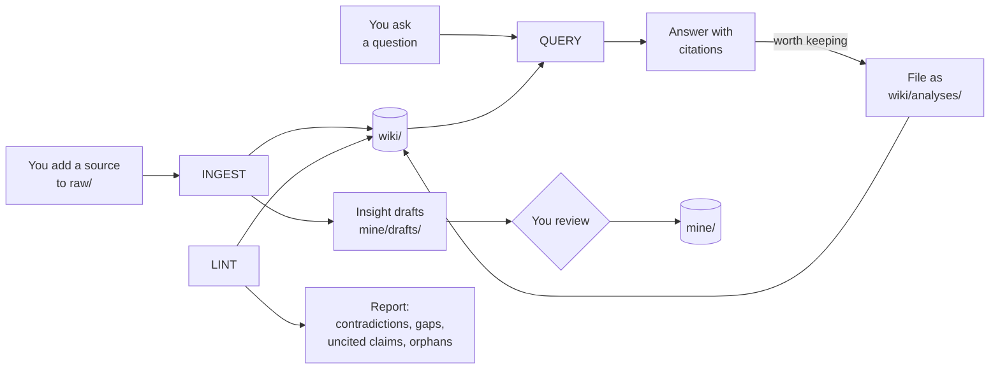

# 02 System Architecture

Back to [[00 Project Home]] · Related: [[03 Trust and Provenance]] · [[04 Vault Blueprint]] · [[08 Claude Operating Instructions]]

## 1. The pattern we adopted
From Karpathy's LLM Wiki idea file. Rather than retrieving from raw documents each time a question is asked, the assistant compiles those documents once into a maintained wiki and keeps it current. The knowledge accumulates instead of being re-derived, and the cross-references and contradictions are already there when you ask.

His summary of the roles fits this project exactly: Obsidian is the IDE, the LLM is the programmer, the wiki is the codebase.

## 2. Three layers
| Layer | Folder | Who writes | Who reads | Contents |
|---|---|---|---|---|
| **Raw sources** | `raw/` | You | Claude | Clipped articles, PDFs, notes, images. **Immutable:** Claude reads them and never changes them. |
| **The wiki** | `wiki/` | Claude | You | Source summaries, entity pages, concept pages, analyses, all cross-linked |
| **The schema** | `CLAUDE.md` plus `system/` | Both, over time | Claude | How the vault is structured and how the operations work |

## 3. What we add on top
| Addition | Why |
|---|---|
| **A thinking layer you own** (`mine/`) | The wiki records what your sources say. It has no home for what *you* conclude. Insights, decisions, and project notes live in `mine/`, where Claude can only leave drafts in `mine/drafts/`. |
| **Provenance rules** | Every wiki claim cites a source in `raw/`. Uncited claims are marked unverified. This stops Claude's own summaries from becoming evidence for later summaries ([[03 Trust and Provenance]]). |
| **Insight extraction at ingest** | Each ingest also proposes 1–3 single-idea drafts into `mine/drafts/`, so reading feeds your thinking layer, not only the reference layer. |
| **An enforcement layer** | Permission rules and git, so the zones hold in practice and every change can be undone ([[08 Claude Operating Instructions]]). |
| **A one-page Obsidian reference** | Just the Obsidian this system needs, picked up while building; no curriculum ([[05 Obsidian Essentials]], D-026). |
| **Product-owner workflows** | After the MVP: meeting notes to decisions, stakeholder briefs, prioritization reasoning (module M7). |

## 4. Components
| Layer | Component |
|---|---|
| Memory | The vault: a git repository of Markdown files on your PC, pushed to a private GitHub repo (D-030) |
| Reading surface | Obsidian |
| Reasoning and maintenance | Claude Code, started inside the vault (Windows Terminal, or the Code tab in Claude Desktop) |
| Navigation | `index.md` (a catalog of every page) and `log.md` (an append-only history) |
| Rules | `CLAUDE.md`, which imports `system/context.md` and `system/conventions.md` |
| Procedures | Claude Code skills: `ingest`, `ask`, `file-answer`, `lint` |
| Enforcement | `.claude/settings.json` permission rules, plus git history |

> [!important] Claude on the web or phone can't see your vault
> Only Claude Code running on the PC can. You can still plan on your phone, as in this thread.

## 5. The three operations

Each operation has its own input zone, so the three never mix: see [[13 Input Zones]].

**Ingest.** You drop a source into `inbox/sources/` and run `/ingest`. Claude reads it, discusses the takeaways with you, writes a summary page, updates every entity and concept page it touches, records contradictions with what's already there, proposes insight drafts, updates `index.md`, and appends to `log.md`. One source can touch ten or more pages. Do them one at a time and stay involved.

**Query.** You ask a question. Claude reads `index.md`, opens the relevant pages, follows links, and answers with links to pages and citations to sources. A good answer can be filed back as an analysis page, so your explorations compound the same way your reading does.

**Lint.** Periodically, Claude health-checks the wiki: contradictions between pages, claims a newer source has superseded, pages with no citation, orphan pages, concepts mentioned but missing a page, gaps worth finding a source for. It reports; you decide.

## 6. Why an index file instead of a search engine
At this scale, a catalog file that Claude reads first is enough to find the right pages, and it avoids running any embedding or vector infrastructure. If the wiki outgrows it, a local Markdown search tool such as qmd can be added later. That's a Phase 5 question, not an MVP one.

## 7. Three layers of control
| Layer | What it does | How strong |
|---|---|---|
| Instructions (`CLAUDE.md`, skills) | Tell Claude how to run each operation | Guidance. Usually followed, never guaranteed. |
| Permission rules (`.claude/settings.json`) | Allow writes in `wiki/`, `mine/drafts/`, `index.md`, and `log.md`; ask for everything else; block edits to `raw/` | Enforced by the software |
| Git | Records every change for review and rollback | The safety net |

## Sources
- LLM Wiki pattern: https://gist.github.com/karpathy/442a6bf555914893e9891c11519de94f
- CLAUDE.md, imports, auto memory: https://code.claude.com/docs/en/memory
- Permission rules and modes: https://code.claude.com/docs/en/permissions
- Claude Code setup on Windows: https://code.claude.com/docs/en/setup
