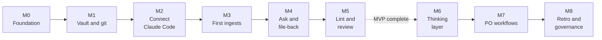

# 06 Roadmap

Back to [[00 Project Home]] · MVP defined in [[01 Project Charter]] §4

## 1. Shape of the plan

## 2. Modules
One chat per module ([[09 Working Agreement]] §4). Estimates assume more than 6 hours a week, with no curriculum in the path (D-026).

| Module | Goal | Main outputs | Done when | Estimate |
|---|---|---|---|---|
| **M0 – Foundation** | Agree the pattern, scope, and ways of working | Documents 00–09, 13, 14 | **Closed 2026-09-19** | Done |
| **M1 – Vault and Git** | A vault built to the blueprint | Obsidian installed and configured; folders from [[04 Vault Blueprint]] §1 including the three `inbox/` zones; git initialised with a first commit; Web Clipper pointed at `inbox/sources/`; documents placed in `mine/projects/thinking-system/` | **Closed 2026-09-21** | Done |
| **M2 – Connect Claude Code** | Claude runs inside the vault under the rules | Claude Code installed; `CLAUDE.md`, `system/conventions.md`, `system/context.md`, permission settings; the page templates and doc 10 (Templates) | **Closed 2026-09-22** | Done |
| **M3 – First Ingests** | The compile loop works | The `ingest` skill and its zone contract ([[13 Input Zones]]); 5 sources in `raw/`, starting with the LLM Wiki gist; `wiki/` populated; `index.md` and `log.md` live | Ingesting source 5 updates at least 3 existing pages, and you've traced one claim back to `raw/` | 3–4 days |
| **M4 – Ask and File-back** | Answers are grounded and reusable | The `ask` and `file-answer` skills; 10 test prompts and recorded results | At least 9 of 10 pass; one answer filed as an analysis page | 2–3 days |
| **M5 – Lint and Review** | The wiki stays honest as it grows | The `lint` skill; the two Bases views; the weekly routine | A lint pass catches a planted contradiction and a planted uncited claim | 2 days |
| **MVP complete** | | | All criteria in [[01 Project Charter]] §6 met | **~2 weeks from M1** |
| **M6 – Thinking Layer** | Your own conclusions accumulate | `mine/insights` and `mine/decisions` in use; the drafts routine | 5 insight pages you wrote, linked to wiki pages | 3–4 days |
| **M7 – Product-Owner Workflows** | The system supports real work | Doc 11 (Playbook); skills for meeting notes to decisions, stakeholder briefs, prioritization reasoning | 3 workflows used weekly for 4 weeks | 4 weeks (set by the calendar) |
| **M8 – Retrospective and Governance** | Decide what comes next, and unpark the rules | Retrospective; doc 12 (Data Governance); Phase 5 scope | Doc 12 written before any work material enters the vault | 1 week |

**Parked until M8:** bank data governance, anything on a bank device, work systems. **Candidates for later:** a local Markdown search tool if `index.md` stops scaling, phone capture and sync, a hook that enforces page status, a scheduled weekly digest.

## 3. M0 closed on 2026-09-19
- [x] Documents 00–09 and 13 accepted
- [x] Decisions D-001 to D-025 accepted
- [x] Q-005 to Q-007 settled or deferred; Q-013 (first sources) moves to the start of M3
- [x] Handover written: [[14 M0 Handover]]
- [x] Documents moved to a private GitHub repo synced into project knowledge (D-028)
- [x] M1 run; Q-014 decided at its close (D-030)

## 4. M1 closed on 2026-09-21
- [x] Obsidian installed and configured per [[05 Obsidian Essentials]] §1
- [x] Folder structure matches [[04 Vault Blueprint]] §1, including the three `inbox/` zones and `mine/scratch/` (D-029)
- [x] Git initialised with `.gitignore` and `.gitattributes`; first commit made
- [x] Web Clipper saving to `inbox/sources/`
- [x] Documents in `mine/projects/thinking-system/`, opening through their links
- [x] Q-014 decided: the vault repo is the single source of truth, pushed to the private repo `second-brain`; the documents repo is archived (D-030)
- [x] Handover written: [[15 M1 Handover]]
- [x] Next: M2 – Connect Claude Code, started 2026-09-21

## 5. M2 closed on 2026-09-22
- [x] Tool facts rechecked against the Claude Code docs (2026-09-21); D-031 to D-035 proposed
- [x] Vault checked against [[04 Vault Blueprint]] §1: every folder and zone file in place
- [x] Schema files placed in the vault: `CLAUDE.md`, `.claude/settings.json`, `system/context.md`, `system/conventions.md`, `index.md`, `log.md`
- [x] Eight templates in `system/templates/`; [[10 Templates]] written
- [x] D-031 to D-038 accepted
- [x] `system/context.md` filled in by you
- [x] Claude Code 2.1.278 installed with the native installer; no API key set ([[08 Claude Operating Instructions]] §6 steps 1–2)
- [x] Schema files committed and pushed (step 3)
- [x] First run: signed in, trust prompt accepted; `/context` loads 3 memory files
- [x] Connectors switched off (D-036); auto memory off and permission rules as expected
- [x] `data` plugin switched off (D-037); `/mcp` empty; `claude doctor` clean (steps 4–6)
- [x] Permission smoke test passes (step 7); a workaround offer after the `raw/` block led to D-038
- [x] Handover written: [[16 M2 Handover]]
- [x] Next: M3 – First Ingests, started 2026-09-22

## 6. M3 in progress, started 2026-09-22
- [x] Tool facts rechecked against the Claude Code docs (skills, permissions, settings scopes, tools); D-040 to D-044 proposed
- [x] `ingest` skill drafted, mirrored in [[08 Claude Operating Instructions]] §4.1; `CLAUDE.md` ingest section cut to a pointer (D-041)
- [x] Overview page type and template added (D-044)
- [x] D-040 to D-044 accepted
- [ ] Q-015 settled: synced skills hidden in vault sessions; `/skills` shows only the vault's and Claude Code's own (D-040)
- [x] Skill moved into `.claude/skills/ingest/SKILL.md`, committed and pushed; `/ingest` appears after a restart
- [ ] Source 1 ingested: Karpathy, LLM Wiki gist. Record whether the move into `raw/` asked or was blocked
- [x] Skill revised after source 1: a page citing one source can be `verified`; links checked before the report; the move check uses file tools
- [ ] Source 2 ingested: Bush, "As We May Think"
- [ ] Source 3 ingested: Matuschak, "Evergreen notes"
- [ ] Source 4 ingested: Anthropic, "Introducing Contextual Retrieval"
- [ ] Source 5 ingested: Forte, "The PARA Method", updating at least 3 existing source, entity or concept pages (`overview.md`, `index.md` and `log.md` don't count, D-044)
- [ ] Each ingest reviewed as in [[05 Obsidian Essentials]] §3 and committed before the next
- [ ] One claim traced from a wiki page to its file in `raw/`
- [ ] Handover written: 17 M3 Handover
