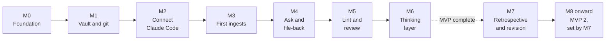

# 06 Roadmap

Back to [[00 Project Home]] · MVP defined in [[01 Project Charter]] §4

## 1. Shape of the plan

## 2. Modules
One chat per module ([[09 Working Agreement]] §4). Estimates assume more than 6 hours a week, with no curriculum in the path (D-026).

| Module | Goal | Main outputs | Done when | Estimate |
|---|---|---|---|---|
| **M0 – Foundation** | Agree the pattern, scope, and ways of working | Documents 00–09, 13, 14 | **Closed 2026-09-19** | Done |
| **M1 – Vault and Git** | A vault built to the blueprint | Obsidian installed and configured; folders from [[04 Vault Blueprint]] §1 including the three `inbox/` zones; git initialised with a first commit; Web Clipper pointed at `inbox/sources/`; documents placed in `mine/projects/thinking-system/` | **Closed 2026-09-21** | Done |
| **M2 – Connect Claude Code** | Claude runs inside the vault under the rules | Claude Code installed; `CLAUDE.md`, `system/conventions.md`, `system/context.md`, permission settings; the page templates and doc 10 (Templates) | **Closed 2026-09-22** | Done |
| **M3 – First Ingests** | The compile loop works | The `ingest` skill and its zone contract ([[13 Input Zones]]); 5 sources in `raw/`, starting with the LLM Wiki gist; `wiki/` populated; `index.md` and `log.md` live | **Closed 2026-09-22** | Done |
| **M4 – Ask and File-back** | Answers are grounded and reusable | The `ask` and `file-answer` skills; 10 test prompts and recorded results | **Closed 2026-09-24** | Done |
| **M5 – Lint and Review** | The wiki stays honest as it grows | The `lint` skill; the two Bases views; the weekly routine | A lint pass catches a contradiction and an uncited claim, using the real cases M4 found (D-059); lint tests 6 of 6 | **Closed 2026-09-24** |
| **MVP complete** | | | All criteria in [[01 Project Charter]] §6 met. 5 of 6 at M5's close; the insights criterion is met in M6 (D-062, D-068) | **Met 2026-09-25: 6 of 6** |
| **M6 – Thinking Layer** | Your own conclusions accumulate | `mine/insights` in use (`mine/decisions` moved to M7, D-068); the drafts routine and the `drafts` skill (D-063 to D-067) | 5 insight pages you accepted, linked to wiki pages (D-068); drafts tests 5 of 5 | **Closed 2026-09-25** |
| **M7 – Retrospective and Revision** | Fit the system to how you work, and scope MVP 2 (D-069) | A retrospective of M0–M6; docs 01 and 06 revised for MVP 2; decisions on the items carried from M6 | You accept MVP 2's scope and module plan | 1 week |
| **M8 onward – MVP 2** | Set by M7 | Candidates: product-owner workflows (doc 11, skills for meeting notes to decisions, stakeholder briefs, prioritization reasoning); doc 12 (Data Governance), written before any work material enters the vault (D-018); what the retrospective finds | Set by M7 | Set by M7 |

**Parked until MVP 2 (scoped in M7):** bank data governance, anything on a bank device, work systems. **Candidates for later:** a local Markdown search tool if `index.md` stops scaling, phone capture and sync, a hook that enforces page status, a scheduled weekly digest.

## 3. M0 closed on 2026-09-19
- [x] Documents 00–09 and 13 accepted
- [x] Decisions D-001 to D-025 accepted
- [x] Q-005 to Q-007 settled or deferred; Q-013 (first sources) moves to the start of M3
- [x] Handover written: [[14 M0 Handover]]
- [x] Documents moved to a private GitHub repo synced into project knowledge (D-028)
- [x] M1 run; Q-014 decided at its close (D-030)

## 4. M1 closed on 2026-09-21
- [x] Obsidian installed and configured per [[05 Obsidian Essentials]] §1
- [x] Folder structure matches [[04 Vault Blueprint]] §1, including the three `inbox/` zones and `mine/scratch/` (D-029)
- [x] Git initialised with `.gitignore` and `.gitattributes`; first commit made
- [x] Web Clipper saving to `inbox/sources/`
- [x] Documents in `mine/projects/thinking-system/`, opening through their links
- [x] Q-014 decided: the vault repo is the single source of truth, pushed to the private repo `second-brain`; the documents repo is archived (D-030)
- [x] Handover written: [[15 M1 Handover]]
- [x] Next: M2 – Connect Claude Code, started 2026-09-21

## 5. M2 closed on 2026-09-22
- [x] Tool facts rechecked against the Claude Code docs (2026-09-21); D-031 to D-035 proposed
- [x] Vault checked against [[04 Vault Blueprint]] §1: every folder and zone file in place
- [x] Schema files placed in the vault: `CLAUDE.md`, `.claude/settings.json`, `system/context.md`, `system/conventions.md`, `index.md`, `log.md`
- [x] Eight templates in `system/templates/`; [[10 Templates]] written
- [x] D-031 to D-038 accepted
- [x] `system/context.md` filled in by you
- [x] Claude Code 2.1.278 installed with the native installer; no API key set ([[08 Claude Operating Instructions]] §6 steps 1–2)
- [x] Schema files committed and pushed (step 3)
- [x] First run: signed in, trust prompt accepted; `/context` loads 3 memory files
- [x] Connectors switched off (D-036); auto memory off and permission rules as expected
- [x] `data` plugin switched off (D-037); `/mcp` empty; `claude doctor` clean (steps 4–6)
- [x] Permission smoke test passes (step 7); a workaround offer after the `raw/` block led to D-038
- [x] Handover written: [[16 M2 Handover]]
- [x] Next: M3 – First Ingests, started 2026-09-22

## 6. M3 closed on 2026-09-22
- [x] Tool facts rechecked against the Claude Code docs (skills, permissions, settings scopes, tools); D-040 to D-044 proposed
- [x] `ingest` skill drafted, mirrored in [[08 Claude Operating Instructions]] §4.1; `CLAUDE.md` ingest section cut to a pointer (D-041)
- [x] Overview page type and template added (D-044)
- [x] D-040 to D-044 accepted
- [ ] Q-015 settled: synced skills hidden in vault sessions; `/skills` shows only the vault's and Claude Code's own (D-040)
- [x] Skill moved into `.claude/skills/ingest/SKILL.md`, committed and pushed; `/ingest` appears after a restart
- [x] Source 1 ingested: Karpathy, LLM Wiki gist, committed 2026-09-22. The move into `raw/` was blocked, so you moved it (D-045)
- [x] Skill revised after source 1: a page citing one source can be `verified`; links checked before the report; the move check uses file tools; the move is yours (D-045)
- [x] Source 2 ingested: Bush, "As We May Think", from MIT's full-text PDF after the first clip was only page 1 of 4. The review added the links to source 1 that the ingest missed
- [x] Skill revised after source 2: ground rules, a search of `wiki/` and `raw/` for every new source, PDF page citations (D-046), partial-clip check
- [x] Source 3 ingested: Matuschak, "Evergreen notes" — the hub page only, so the five principles are recorded as titles and the 15 linked notes as gaps
- [x] Source 4 ingested: Anthropic, "Introducing Contextual Retrieval" — the disagreement with source 1 recorded on both sides; D-047 narrows which pages carry `contested`, accepted the same day
- [x] Source 5 ingested: Forte, "The PARA Method", updating 6 existing pages, 3 of them with new cited claims, against a bar of 3 (D-044). A second disagreement recorded on both sides
- [x] Each ingest reviewed as in [[05 Obsidian Essentials]] §3 and committed before the next
- [x] One claim traced from a wiki page to its file in `raw/`: `Associative indexing` → Bush on cumbersome rules → `raw/bush-as-we-may-think.pdf` page 14
- [x] Handover written: [[17 M3 Handover]]
- [x] Next: M4 – Ask and File-back, started 2026-09-24

**Parked in M3, to pick up after the MVP unless they start to hurt:**
- Matuschak's five principle notes and the Zettelkasten sources. The gaps are recorded in `wiki/overview.md` and on [[07 Decision Log]]'s next-sources list, so nothing is lost.
- The `ingest` report splitting "updated" into pages that gained a claim and pages that only gained a link.
- D-040's `skillOverrides` entry, which waits for the list of names in `~/.claude/skills/synced`.

## 7. M4 closed on 2026-09-24
- [x] `ask` and `file-answer` skills written, mirrored in [[08 Claude Operating Instructions]] §4.2–4.3; the ask section of `CLAUDE.md` cut to a pointer plus the rules for direct questions
- [x] Test prompts made concrete for this wiki ([[08 Claude Operating Instructions]] §5); `system/test-results.md` and `test-injection.md` written
- [x] D-048 to D-052 accepted
- [x] Skills moved into `.claude/skills/ask/` and `.claude/skills/file-answer/`, committed and pushed; both appear in `/skills`
- [x] Tests 1–6 run and recorded. Test 4 found Poppler missing; you installed it, and Claude installed nothing
- [x] Test 7 run with `test-injection.md`; the file deleted afterwards
- [x] Test 8 run: `Compare the PARA method and evergreen notes as ways to organise what I read` filed in `wiki/analyses/`, reviewed and committed. Its re-check caught an unsupported claim, now in `inbox/checks.md`
- [x] Tests 9 and 10 run: **10 of 10**
- [x] Fix batch from the test findings: answer sections, recommendation rule (D-053), no installing (D-054), unreadable raw files, Related links. No rerun needed
- [x] Handover written: [[18 M4 Handover]]
- [x] Next: M5 – Lint and Review, started 2026-09-24

**Parked in M4, to pick up when they start to hurt:**
- A naming rule for a source with no author (test 7 produced `unknown-...`).
- Analysis page titles are the question word for word, which can be long.

## 8. M5 closed on 2026-09-24
- [x] D-053 and D-054 accepted
- [x] `lint` skill drafted and mirrored in [[08 Claude Operating Instructions]] §4.4; the lint section of `CLAUDE.md` cut to a pointer, and two citation rules added (D-055 to D-057)
- [x] `system/views/Review.base` drafted with both views (D-058), mirrored in [[05 Obsidian Essentials]] §6
- [x] Weekly review written as steps in [[05 Obsidian Essentials]] §4
- [x] Lint tests L1–L6 written in [[08 Claude Operating Instructions]] §5 and `system/test-results.md` (D-059)
- [x] D-055 to D-059 accepted
- [x] Files placed: the skill in `.claude/skills/lint/`, `Review.base` in `system/views/` and bookmarked; committed and pushed
- [x] Views checked: Needs attention shows 8 pages (1 `unverified`, 7 `contested`); Draft queue shows 11
- [x] L1–L4: first `/lint`, report read and committed. 14 findings; 13 confirmed against `raw/`, and finding 5 was the skill's own error, fixed in `lint` and `file-answer`
- [x] L5: `/lint apply` for all findings but 5: exactly those 13 fixes, no status changes, reviewed and committed
- [x] L6: second `/lint` in a fresh session: 13 pages deep-checked, none of the applied findings back, finding 5 gone, and 3 new real problems found. **Lint tests 6 of 6; M5's exit criterion is met**
- [x] D-060 (monthly full deep check) and D-061 (wrong PDF page is Low) accepted; `lint` revised to match
- [x] Fixes from report-2026-09-24-2 applied and committed: 3 findings, 8 pages, no status changes
- [x] Weekly review steps 1–3 run twice (lint, apply, commit); steps 4–7, including the first pass through the draft queue, move to M6
- [x] MVP criteria in [[01 Project Charter]] §6 checked: 5 of 6, with the insights criterion moved to M6 (D-062)
- [x] Handover written: [[19 M5 Handover]]
- [x] Next: M6 – Thinking Layer, started 2026-09-24

**Parked in M5, to pick up when they start to hurt:**
- A written rule for uncited lines that only restate cited claims (lint currently reads them as synthesis).
- Checking `mine/drafts/` claims against `raw/` before you keep one; M6 decides. Proposed in M6 as the `drafts` skill (D-064).

## 9. M6 closed on 2026-09-25
- [x] D-062 accepted: the MVP's insights criterion is met at M6's close
- [x] Drafts routine written: keep means you write a new page, and no draft waits a week (D-063); weekly review step 5 rewritten in [[05 Obsidian Essentials]] §4
- [x] `drafts` skill drafted and mirrored in [[08 Claude Operating Instructions]] §4.5; `CLAUDE.md` gets its pointer (D-064)
- [x] Insight page rules: `origin`, `status`, `reviewed` and how Relations read (D-065); `mine/decisions/` versus doc 07 (D-066); drafts from `ingest` cite `raw/` (D-067). Insight template, `system/conventions.md`, `Review.base` and docs 02, 03, 04, 05 and 10 updated to match
- [x] Drafts tests R1–R5 written in [[08 Claude Operating Instructions]] §5 and `system/test-results.md`
- [x] D-063 to D-067 accepted (2026-09-25)
- [x] Files placed: `drafts` skill in `.claude/skills/drafts/`, `ingest` skill replaced, the rest copied over; committed and pushed (75f7537); `/skills` lists `drafts`
- [x] R1–R4: first `/drafts` on the 11 drafts, committed (45526e4). **4 of 4.** 2 clean, 9 with problems; every finding checked against `raw/` and holds, including five beyond the expected ones (`system/test-results.md`)
- [x] D-068 accepted: the five MVP insights are written by Claude from the checked drafts and accepted by you
- [x] 5 insights placed in `mine/insights/`, each with Relations linking `wiki/`, and all 11 drafts deleted (1b6beb3). That completes the first cycle through the Draft queue
- [ ] Weekly review steps 4, 6 and 7: not run in M6. Nothing waited on them (no new lint report, `mine/scratch/` empty); the first full weekly review is next week
- [x] R5: second `/drafts` in a fresh session (a7fb417). **Drafts tests 5 of 5; M6's exit criterion is met**
- [x] `system/context.md` "Current focus" updated (your file, 70cf510)
- [x] MVP criteria in [[01 Project Charter]] §6 checked: **6 of 6. MVP complete, 2026-09-25**
- [x] Q-016 answered: the revision is the next module, M7 – Retrospective and Revision (D-069)
- [x] Handover written: [[20 M6 Handover]]
- [ ] **Next:** M7 – Retrospective and Revision

**Carried to M7, the revision (D-068, D-069):**
- The five insights are `origin: claude`. Rewrite them, keep them as they are, or archive them.
- The first decision page in `mine/decisions/`.
- Two drafts that weren't kept: `The schema doc is the highest-leverage part of this vault to get right` (its Check was clean) and `Per-source review beats batch ingest for this vault`. Git keeps both.
