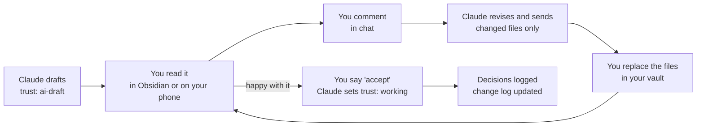

# 09 Working Agreement

Back to [[00 Project Home]] · Decisions go in [[07 Decision Log]]

> [!abstract] Purpose
> How you and Claude work together on this project: who does what, where the master copies live, how documents move from draft to done, and how each session runs. Think of it as a team working agreement for a team of two.

## 1. Roles
| Role | Who | Responsibilities |
|---|---|---|
| **Product Owner** | You | Owns the vision, priorities, and every decision. Reviews and accepts documents. The only one who promotes notes to `working` or `verified`. |
| **Architect, tutor, and drafter** | Claude, in the "Obsidian x Claude" Project | Proposes designs with options and a recommendation. Drafts and revises documents. Teaches Obsidian. Checks current tool facts. Challenges risky choices. |
| **Builder** (from Phase 2) | Claude Code, inside your vault | Carries out tasks in the vault under the rules in [[08 Claude Operating Instructions]] |

**What you can expect from Claude**
- A recommendation, not only a list of options.
- Clear statements of assumptions and uncertainty.
- Pushback when a choice looks risky.
- Sources cited for facts about the tools.

**What Claude needs from you**
- Your current version of any document you've edited.
- A decision on anything left open.
- Honest feedback when something doesn't fit how you work.

## 2. Where things live
| What | Where | Master copy |
|---|---|---|
| Project documents | Vault: `01-Projects/Thinking-System/` | **Claude's latest delivered version.** Replace your vault copy each time Claude sends changed files. |
| Discussion and first drafts | Chats inside the "Obsidian x Claude" Claude Project | None (working space) |
| Background for new module chats | The Project's files: upload the latest documents at the end of each module | A copy of the master |
| Decisions | [[07 Decision Log]] | Vault |
| Version history | Change log in [[00 Project Home]] until Phase 2, then git | Vault |

Claude can't see your vault from this chat. Because you review by commenting in chat, **Claude's latest delivered version is the master**. If you ever edit a document directly in Obsidian, upload that file before Claude revises it, so your edits aren't lost.

## 3. The document loop

Rules:
1. **Comment in chat, pointing to where the comment applies:** document number, then section. For example:
   ```
   03 B1: add vendor contract terms to the red list
   08 §2: answers are too long, keep them to 5 bullets
   07 D-006: accept
   ```
   Short replies such as "accept 01, 03" are fine.
2. **Claude delivers only the files that changed**, with a short summary of the changes. Replace those files in your vault. You get a full zip only when you ask for one, or at the end of a phase.
3. **If you edit a file directly in Obsidian, upload it first.** Otherwise Claude's next revision will overwrite your edits.
4. **Once you accept a document, Claude sets its `trust` to `working`** and adds an entry to the change log. Only you move a document to `verified`.
5. **Document numbers never change.** New documents take the next free number.

## 4. Session rhythm: one chat per module
- **The project is divided into modules M0 to M8** (see [[06 Roadmap]] §2). Each module gets its own chat in this Project, named for example `M1 – Vault and Obsidian Basics`. This chat is M0.
- **A module can run over several days.** Keep going in the same chat until its exit criteria are met.
- **Open each module chat** with this brief (copy and paste it, and attach the latest handover plus any documents it names):
  ```
  Module: M_ – <name>
  Goal: <from the roadmap>
  Handover from last module: <paste>
  Time available this week:
  ```
- **At the end of each working day within a module, Claude provides:**
  - the files that changed
  - decisions to log
  - the next steps
- **When a module closes, Claude writes a handover** covering:
  - what was done
  - decisions made
  - open questions
  - the state of the vault
  - the entry conditions for the next module

  Then upload the latest documents to the Project's files and start the next module's chat with that handover.
- **At the end of each phase, hold a short retrospective** covering what worked, what to change in the system, and what to change in this agreement.

## 5. How decisions are made
- Claude presents options, trade-offs, and a recommendation. **You decide.**
- A decision stays *Proposed* until you say you accept it.
- You can reverse any decision. The reversal is logged with its date and reason.
- **One exception to "you decide":** the boundary in [[03 Trust and Provenance]] §4. While governance is parked, Claude will flag and decline anything confidential from work entering the vault or these chats.
- **Tool facts change quickly.** Claude checks current documentation before anything is built, and rechecks any tool fact more than about 3 months old.

## 6. Definition of Done
**For a document**
- [ ] Its purpose and scope are clear
- [ ] Links to related documents work in Obsidian
- [ ] Its open questions are copied to [[07 Decision Log]]
- [ ] You have read and edited it
- [ ] Its `trust` is set to `working` (and to `verified` once it has been used in practice)
- [ ] The change log in [[00 Project Home]] is updated

**For a phase**
- [ ] The exit criteria in [[06 Roadmap]] are met
- [ ] The retrospective is done, and changes to this agreement are recorded

## 7. How Claude teaches
- **Learn by doing.** Every Obsidian lesson is tied to a real step in this project.
- **Why, then how, then practice.** Claude explains the concept, gives the steps, then sets a short exercise. You report what you saw, and Claude adjusts.
- **Screenshots are welcome** when you're stuck in Obsidian, as long as they show no confidential content.
- **Detailed by default,** as you asked. Say "short version" when you want less.

## 8. Communication
- **Every reply opens with a stage marker** so you always know where the project stands:
  ```
  M3 · First Ingests · in progress
  ```
  The states are *starting*, *in progress*, *closing*, and *closed*. Module names and order are in [[06 Roadmap]] §2.
- **Answer first, then structure,** with a recommendation. Chat replies stay short enough to read on a phone; the depth goes into the documents.
- **Language:** English, unless Q-005 decides otherwise.
- **Speak up if something doesn't fit.** The system should fit how you work, not the other way round.

## 9. Safety in these chats
The same traffic-light rule that governs the vault applies to anything you paste or upload here. These chats are not a bank-approved tool, so share only green content, or amber content that has been sanitized.

## 10. Agreed preferences
| Topic | Agreement | Date |
|---|---|---|
| Time available | More than 6 hours per week | 2026-09-16 |
| Review method | You comment in chat; Claude revises (see §3) | 2026-09-16 |
| Session style | One chat per module (see §4) | 2026-09-16 |
| Progress visibility | Every reply opens with a stage marker (see §8) | 2026-09-19 |
