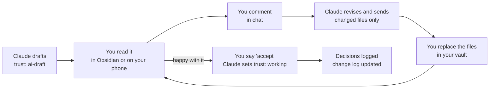

# 09 Working Agreement

Back to [[00 Project Home]] · Decisions go in [[07 Decision Log]]

> [!abstract] Purpose
> How you and Claude work together on this project: who does what, where the master copies live, how documents move from draft to done, and how each session runs. Think of it as a team working agreement for a team of two.

## 1. Roles
| Role | Who | Responsibilities |
|---|---|---|
| **Product Owner** | You | Owns the vision, priorities, and every decision. Reviews and accepts documents. The only one who promotes notes to `working` or `verified`. |
| **Architect, tutor, and drafter** | Claude, in the "Obsidian x Claude" Project | Proposes designs with options and a recommendation. Drafts and revises documents. Teaches Obsidian. Checks current tool facts. Challenges risky choices. |
| **Builder** (from Phase 2) | Claude Code, inside your vault | Carries out tasks in the vault under the rules in [[08 Claude Operating Instructions]] |

**What you can expect from Claude**
- A recommendation, not only a list of options.
- Clear statements of assumptions and uncertainty.
- Pushback when a choice looks risky.
- Sources cited for facts about the tools.

**What Claude needs from you**
- Your current version of any document you've edited.
- A decision on anything left open.
- Honest feedback when something doesn't fit how you work.

## 2. Where things live
| What | Where | Master copy |
|---|---|---|
| Project documents | The vault, at `mine/projects/thinking-system/`, pushed to the private GitHub repo `second-brain` (D-030) | **The vault repo.** Drop Claude's changed files into that folder, check `git diff`, commit, push, then click Sync. |
| Discussion and first drafts | Module threads in the "Obsidian x Claude" Claude Project, one standing chat per module (§4) | None (working space) |
| Background for every thread | Project knowledge, synced from `mine/projects/thinking-system/` in the vault repo | A synced copy of the master |
| Decisions | [[07 Decision Log]] | Vault |
| Version history | Git, plus the change log in [[00 Project Home]] | Vault repo |

Claude reads the documents through project knowledge, which syncs only `mine/projects/thinking-system/`, not the rest of the vault. **After every push, click Sync before working in a chat;** otherwise Claude reads the previous version. If you edit a document yourself, push it and sync before asking Claude to revise it, so your edits aren't lost.

## 3. The document loop

Rules:
1. **Comment in chat, pointing to where the comment applies:** document number, then section. For example:
   ```
   03 B1: add vendor contract terms to the red list
   08 §2: answers are too long, keep them to 5 bullets
   07 D-006: accept
   ```
   Short replies such as "accept 01, 03" are fine.
2. **Claude delivers only the files that changed**, with a short summary of the changes. Replace those files in `mine/projects/thinking-system/`, read `git diff`, then commit and push. You get a full zip only when you ask for one, or at the end of a phase.
3. **If you edit a file directly in Obsidian, commit, push, and Sync first.** Otherwise Claude's next revision will overwrite your edits.
4. **Once you accept a document, Claude sets its `trust` to `working`** and adds an entry to the change log. Only you move a document to `verified`.
5. **Document numbers never change.** New documents take the next free number.

## 4. Module threads
Every module has **one standing chat** in this Project, named `M<n> – <name>`. It isn't a one-off conversation: it's the permanent home of what that module owns, for the life of the project ([[07 Decision Log]] D-071).
- **M0 – Project Management** is the thread this project started in. It owns the plan: scope, the roadmap, the decision log, retrospectives, handovers and this agreement (D-070). Foundation was its first piece of work.
- **Build modules, M1 onward,** each run to an exit in [[06 Roadmap]] §2. When a module meets its exit, Claude writes a handover, and the thread stays open to maintain what the module built.
- **Work can run over several days.** Keep going in the same chat.

**Who owns what.** Work goes to the thread that owns the part it changes. If it changes the plan or the scope, or needs larger changes in what two threads own, it goes to M0 first. M0 splits it and briefs the owning threads.

| Thread                   | Owns and maintains                                                                                                                                                      |
| ------------------------ | ----------------------------------------------------------------------------------------------------------------------------------------------------------------------- |
| M0 – Project Management  | Docs 00, 01, 02, 03, 06, 07 and 09; the handovers; retrospectives (doc 21); the backlog (doc 22); the MVP scope; work that crosses modules                              |
| M1 – Vault and Git       | Folder structure and naming ([[04 Vault Blueprint]] §1, §7); `.gitignore` and `.gitattributes`; Obsidian settings and the Web Clipper ([[05 Obsidian Essentials]] §1–2) |
| M2 – Connect Claude Code | `CLAUDE.md`, `.claude/settings.json`, `system/conventions.md` and the templates ([[10 Templates]]); [[08 Claude Operating Instructions]] §1–3 and §6                    |
| M3 – First Ingests       | The `ingest` skill (08 §4.1); [[13 Input Zones]]; the `index.md` and `log.md` formats (04 §5–6); reviewing an ingest (05 §3)                                            |
| M4 – Ask and File-back   | The `ask` and `file-answer` skills (08 §4.2–4.3); test prompts 1–10                                                                                                     |
| M5 – Lint and Review     | The `lint` skill (08 §4.4); `Review.base` (05 §6); the weekly review (05 §4); the lint tests                                                                            |
| M6 – Thinking Layer      | The `drafts` skill (08 §4.5); the rules for `mine/` (04 §2–4); the Insight and Decision templates; 05 §4 step 5 and §5; the drafts tests                                |

Where two rows touch the same file, the more specific row owns that part. A skill's mirror in doc 08 changes with the skill, in the same commit. A thread may make small edits that follow from its own work in files another thread owns, such as a pointer in `CLAUDE.md`, a line in `system/conventions.md` or a cross-reference, and lists them in its change summary. Anything larger goes to the owning thread as a request.

**Briefs.** Threads can't read each other; the documents in project knowledge carry the context between them. Start work in a thread with one of these:
- **Opening a new build module:**
  ```
  Module: M<n> – <name>
  Goal: <from 06 Roadmap>
  Handover: <latest handover, in project knowledge>
  Read first: <documents>
  Time available this week:
  ```
- **A request to an existing thread,** from you or passed on by another thread:
  ```
  M<n> · <name> · request from <me | M0 | M<k>>
  What: <the change, in one or two lines>
  Why: <decision ID, finding or need>
  Read first: <documents or files>
  Done when: <what I'll accept>
  ```

**Rules for every thread**
- **Push and Sync before you start** (§2). A thread works from the synced documents; where they differ from what was said earlier in the chat, the documents win.
- **Decision IDs** come from the synced [[07 Decision Log]]: the next free number. If two threads take the same ID before a Sync, M0 renumbers the later one.
- **At the end of each working day, Claude provides:** the files that changed, the decisions to log, and the next steps.
- **When a build module meets its exit, Claude writes a handover** covering what was done, decisions made, open questions, the state of the vault, and what the next piece of work needs. Push and Sync, then take it to the thread the handover names.
- **When a thread's work needs a change another thread owns,** Claude names the change and gives you a request brief for that thread.
- **At the end of each phase, hold a short retrospective in M0,** covering what worked, what to change in the system, and what to change in this agreement.

## 5. How decisions are made
- Claude presents options, trade-offs, and a recommendation. **You decide.**
- A decision stays *Proposed* until you say you accept it.
- You can reverse any decision. The reversal is logged with its date and reason.
- **One exception to "you decide":** the boundary in [[03 Trust and Provenance]] §4. While governance is parked, Claude will flag and decline anything confidential from work entering the vault or these chats.
- **Tool facts change quickly.** Claude checks current documentation before anything is built, and rechecks any tool fact more than about 3 months old.

## 6. Definition of Done
**For a document**
- [ ] Its purpose and scope are clear
- [ ] Links to related documents work in Obsidian
- [ ] Its open questions are copied to [[07 Decision Log]]
- [ ] You have read and edited it
- [ ] Its `trust` is set to `working` (and to `verified` once it has been used in practice)
- [ ] The change log in [[00 Project Home]] is updated

**For a phase**
- [ ] The exit criteria in [[06 Roadmap]] are met
- [ ] The retrospective is done, and changes to this agreement are recorded

## 7. Explanations, not lessons
- **Build first.** Claude gives the steps to take, not a curriculum. No exercises, no stages, no homework (D-026).
- **Explain on demand, or when it costs something.** Claude explains a choice unprompted only when getting it wrong would be expensive to undo, such as folder names the permission rules depend on. Otherwise, ask and you'll get it.
- **Screenshots are welcome** when you're stuck in Obsidian, as long as they show no confidential content.
- **One exception that isn't negotiable:** reviewing what an ingest produced ([[05 Obsidian Essentials]] §3). Skipping that turns the provenance rules into decoration.

## 8. Communication
- **Every reply opens with a stage marker** so you always know where the project stands:
  ```
  M3 · First Ingests · in progress
  ```
  A build module is *starting*, *in progress*, *closing* or *closed*. After its exit, its thread is *maintaining* whenever it works on what the module owns, e.g. `M5 · Lint and Review · maintaining`. M0 is *in progress* while it works on the plan. Module names and order are in [[06 Roadmap]] §2.
- **Diagrams are Mermaid** (D-073), drawn to these rules (D-074):
  - First line `%%{init: {"flowchart": {"curve": "step", "useMaxWidth": true, "nodeSpacing": 12, "rankSpacing": 25, "padding": 8, "subGraphTitleMargin": {"top": 4, "bottom": 8}}}}%%`: the diagram scales to the window width and uses elbow connectors, not curves.
  - Flowcharts only. A lifecycle is drawn as a flowchart, or as a table when its arrows would cross.
  - Fit the window: top-down by default, no wider than about 800 px (overview grids and maps up to about 1,100 px), labels broken with `<br/>`. The compact spacing in the first line helps.
  - Every group names its level: `Stage n · …`, `Role n · …`, `Location · …`, `User story US-nn · …`, `Legend · …`. One level per layer of grouping.
  - A legend whenever colour or shape carries meaning: inside the diagram, top-left where the layout allows, or once per section for diagrams that share it.
  - Every diagram is rendered before delivery, with no errors.
- **Phrasing is short:** lead with the count or the noun ("6 commands:", not "There are six commands").
- **Answer first, then structure,** with a recommendation. Chat replies stay short enough to read on a phone; the depth goes into the documents.
- **Language:** English, unless Q-005 decides otherwise.
- **Speak up if something doesn't fit.** The system should fit how you work, not the other way round.

## 9. Safety in these chats
The same traffic-light rule that governs the vault applies to anything you paste or upload here. These chats are not a bank-approved tool, so share only green content, or amber content that has been sanitized.

## 10. Agreed preferences
| Topic | Agreement | Date |
|---|---|---|
| Time available | More than 6 hours per week | 2026-09-16 |
| Review method | You comment in chat; Claude revises (see §3) | 2026-09-16 |
| Session style | One standing thread per module, with M0 for project management (see §4) | 2026-09-16; standing threads from 2026-09-25 |
| Progress visibility | Every reply opens with a stage marker (see §8) | 2026-09-19 |
| Guidance style | Steps only; explanations on request, or when a mistake would be expensive to undo (see §7) | 2026-09-21 |
| Document master | The vault repo; project knowledge syncs `mine/projects/thinking-system/` (see §2) | 2026-09-21 |
| Diagrams | Mermaid only, in documents, chat and the vault (D-073, see §8) | 2026-09-26 |
| Writing style | Short phrasing: the count or the noun first (see §8) | 2026-09-26 |
| Diagram style | Elbow connectors, fit to the window, labelled group levels, a legend (D-074, see §8) | 2026-09-26 |
