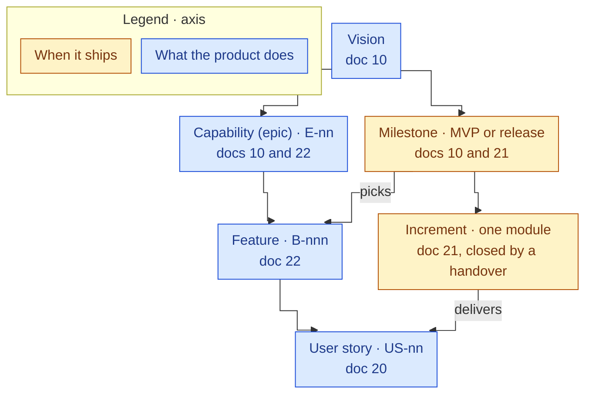
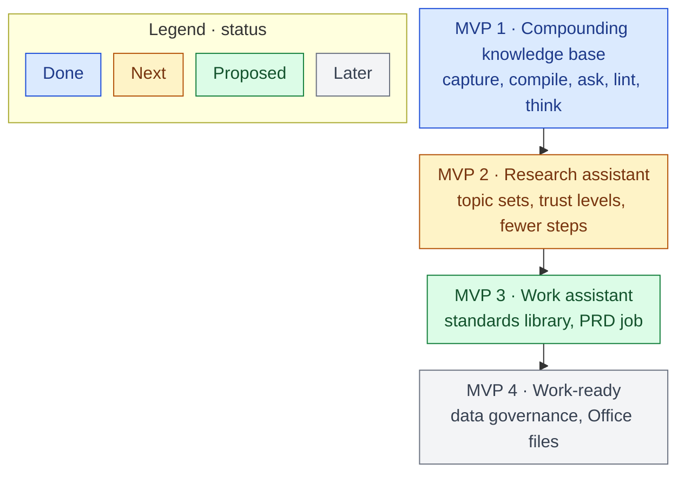

# 10 Product Vision

Back to [[00 Project Home]] · Phase: Plan, strategy · Owned by M0 – Project Management · Broken down in [[22 Product Backlog]] · Scheduled in [[21 Roadmap]]

> [!abstract] What this is
> Where the product is going beyond any one MVP: who it's for, what they need, what it does, how success is measured, and how the vision breaks down into milestones, capabilities and backlog features. Proposed 2026-09-30 ([[03 Decision Log]] D-076). It replaces [[11 Project Charter]] §1 as the product vision; the charter stays the record of MVP 1's scope.

## 1. Vision
**Everything I learn becomes knowledge I can prove, and everything I produce starts from it, done to my standards.**

**Elevator pitch**
- **For** a product owner of financial products who has to learn new domains fast and turn what they learn into work outputs,
- **Second Brain** is a personal knowledge assistant
- **that** compiles what they read into a cited, verified knowledge base, and uses it to do defined jobs to their standards.
- **Unlike** chat assistants, which forget between sessions and can't show where a fact came from, and note apps, which leave the bookkeeping to you,
- **it** traces every fact to its source in one click, and shapes every output to your templates, style and audience.

**The principle,** in your words (your note "Second Brain Introduction", 2026-09-29): "AI helps me do the work – I verify and guarantee its outcomes."

## 2. Vision board

### 2.1 Target group
- **Primary persona: the owner.** A product owner of financial products (lending, cards, payments, onboarding) who uses Claude as the main research tool. Learns new domains fast; the current one is the UK financial system and its legal framework. Writes PRDs, briefs and analyses. Comfortable with a terminal, on Windows, with about 6 hours a week for this.
- **Later segment:** product owners, business analysts and consultants in regulated industries, where a fact without a source is a risk. It isn't served until the product works for one user (D-078).

### 2.2 Needs
| # | When I… | I want to… | so that… | Today |
|---|---|---|---|---|
| N1 | start a new domain | research it as a set of sources, with facts ranked by trust and conflicts resolved | I learn fast and can defend what I learnt | One source per run, no trust levels ([[87 MVP Retrospective]] §5) |
| N2 | read something useful | keep it where it compounds | nothing useful disappears into chat history | Met by MVP 1 |
| N3 | rely on a fact | trace it to its source in under a minute | I never have to take Claude's word for it | Met by MVP 1 (G5) |
| N4 | produce a standard output, such as a PRD or a brief | have it drafted from my knowledge, to my template, style and audience | my time goes on judgement, not grunt work | Not built |
| N5 | hand work to Claude | stay in control: nothing changes without my say, and confidential material stays out | I can trust it with more over time | Met for personal and public sources; work material waits on doc 36 |

### 2.3 Product
9 capabilities, from capturing a source to showcasing the product (§4.2).

### 2.4 Goals
- **Learn faster:** a new domain becomes usable knowledge in days, with facts I can defend.
- **Produce faster:** standard PO outputs drafted from my own knowledge, to a consistent standard.
- **Show the work:** the product and its record demonstrate my product-owner practice, from vision to backlog, decisions, delivery and retrospectives (D-079), once the product is worth showing (D-082).

## 3. Measures of success
**North Star: trusted outputs per month.** An output is an answer I file or a job's product, where every fact traces to `raw/` or is labelled. It grows only when the knowledge base is both used and trustworthy.

| Metric | Kind | Baseline, MVP 1 | Target direction |
|---|---|---|---|
| Trusted outputs per month | North Star | 1 analysis page filed (M4) | Up |
| Your steps per source ingested | Effort | 3 of 5, one source per run | Down |
| Time from a new topic to usable knowledge | Speed | Not measured | Down |
| Share of wiki pages `verified` | Quality | 19 of 27 at MVP close | Up |
| Errors caught before use | Guardrail | First lint: 13 real findings; `/drafts`: 9 of 11 drafts flagged | Caught at check time, never after use |
| Time to trace a claim | Guardrail | Under a minute (G5) | Stays under a minute |
| Confidential items in the vault | Guardrail | 0 | Stays 0 |

How each is measured, and the targets per milestone, go in doc 12 (Success Metrics, B-031).

## 4. From vision to backlog
The product breaks down one way and ships another. Capabilities and features describe what the product does; milestones and increments decide when it ships ([[03 Decision Log]] D-077).

### 4.1 Milestones
The split between research and jobs is accepted (D-081), and MVP 2 comes next (D-082). What goes into each milestone is set when it is scoped.

| Milestone | Goal | Capabilities | Needs met | Status |
|---|---|---|---|---|
| **MVP 1 · Compounding knowledge base** | The working loop: capture, compile, ask, file back, lint, think | E-01 to E-05, E-07 | N2, N3, N5 (personal) | **Done 2026-09-25**, 6 of 6 criteria |
| **MVP 2 · Research assistant** | Research a topic as a set, large documents included: trust-ranked, verified facts, with fewer manual steps | E-01, E-02, E-04, E-05, E-07, E-08 | N1 | **Next.** Scope accepted (D-084): [[11 Project Charter]] §11 |
| **MVP 3 · Work assistant** | Defined jobs to your standards, a PRD first | E-06 | N4 | Proposed |
| **MVP 4 · Work-ready** | Work material under data governance; Office files as sources | E-01, E-07 | N5 (work) | Later |

**Showcase gate:** at the end of each MVP you decide whether it is the moment to showcase the product (D-082). The bar (D-083): a chat answer from the vault beats a default Claude answer through its fact guarantee, while Claude keeps its ability to research. That takes cited research summaries, batch ingest with conflicts and trust sorting, and `/import` for duplicates and versions, with the four current commands unchanged. The showcase itself is E-09.

The milestones split the candidate goal in [[87 MVP Retrospective]] §7.2 (research and a PRD job in one milestone) in two, so each ships something usable sooner (D-081).

### 4.2 Capabilities
| ID | Capability | What it does for the owner | Built in MVP 1 | Features next ([[22 Product Backlog]]) |
|---|---|---|---|---|
| E-01 | **Capture** | Gets material in: web clips, files, Claude outputs | Web Clipper and the inbox zones (US-01) | B-001, B-002, B-004, B-005, B-037 |
| E-02 | **Compile and verify** | Turns sources into cited pages, with status, conflicts and trust | `/ingest`, one source per run (US-02, US-09) | B-003, B-006 to B-009, B-038 |
| E-03 | **Ask and reuse** | Answers from your own sources, and keeps the good ones | `/ask`, `/file-answer` (US-03, US-04) | B-010 |
| E-04 | **Keep healthy** | Finds what's wrong or stale before you rely on it | `/lint`, the review views, the weekly review (US-05, US-06, US-08, US-12) | B-011 to B-014 |
| E-05 | **Think** | Holds your own conclusions and decisions | `/drafts`, the insights routine (US-07) | B-015, B-016 |
| E-06 | **Jobs and standards** | Produces work outputs to your standards | Not built. The diagram rules (D-074) are the first standard | B-017 to B-021 |
| E-07 | **Control and safety** | Nothing changes without your say; confidential material stays out | Permission rules, git, the data boundary (US-10, US-11) | B-022, B-023 |
| E-08 | **Operate** | Keeps running with little effort, and changes safely | Module threads, the document loop (US-13) | B-024 to B-027 |
| E-09 | **Showcase and documentation** | Shows the product and how it was built | This document set; the PRD | B-028 to B-036 |

## 5. What it is not
- **Not a team product,** for now: one owner.
- **Not autopilot:** Claude proposes and you decide. Nothing in `mine/` carries your name unless you wrote it.
- **Not a web search engine:** a web page is never evidence (D-075).
- **Not a home for work material** until doc 36 exists (D-018).
- **Not lock-in:** plain Markdown in git.

## 6. Principles
The six in [[11 Project Charter]] §8 hold for every milestone. MVP 1 adds two:

7. **Provenance before speed.** Automation never skips the checks that open `raw/`; they caught every error so far ([[87 MVP Retrospective]] §2).
8. **Standards are written down.** A standard exists as a file in the vault before any job uses it.
