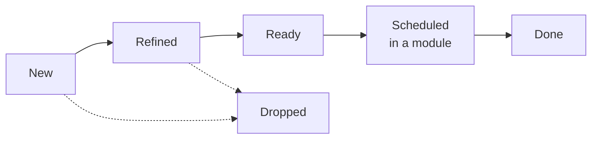

# 22 Product Backlog

Back to [[00 Project Home]] · Owned by M0 – Project Management ([[09 Working Agreement]] §4) · Scheduled work lives in [[06 Roadmap]]

> [!abstract] What this is
> Where needs and ideas wait before they reach the roadmap. An item enters here, gets refined, and moves into a module only when M0 schedules it. Nothing here commits the project to building anything ([[07 Decision Log]] D-072).

## 1. How items move

- **New:** captured as said, with the need in one line.
- **Refined:** scope, options, dependencies and open questions written, and the questions answered.
- **Ready:** small enough for one module, with a "done when" you'd accept.
- **Scheduled:** M0 puts it in [[06 Roadmap]] and names the owning thread.
- **Dropped:** with a line saying why. Items are never deleted.

IDs run from B-001 and never change. Priority stays blank until the MVP 2 scoping sets it.

## 2. Backlog
| ID | Item | Status | Depends on | Would be owned by |
|---|---|---|---|---|
| B-001 | Office documents as sources | New | Doc 12, for work files (D-018) | M3 (`ingest`), M1 (naming) |
| B-002 | Mermaid support | New; scope to confirm | — | M3 or M4, by scope |

## 3. Items

### B-001 · Office documents as sources
**Need:** much product-owner material comes as Word, Excel and PowerPoint files, and `ingest` stops on them today.
**Raised:** 2026-09-25, M0, after reviewing which formats `raw/` supports.
**Today:** `raw/` takes Markdown and PDF. Claude Code's file reader doesn't open Office files, and the `ingest` ground rules forbid saving a converted copy, because that copy would be Claude's rendering rather than the source ([[08 Claude Operating Instructions]] §4.1). So you convert by hand first.
**Options to weigh when refining:**
- **a. You save as PDF before capture.** Nothing to build, and page citations already work (D-046). Spreadsheet structure is lost.
- **b. A converter you run, not Claude, produces Markdown.** The original and the converted text both go into `raw/`, with a rule saying which one citations point at.
- **c. Claude reads Office files through an installed tool.** Needs your install (D-054), plus a citation form for a slide, a sheet or a cell.

**Open questions:** which of the three formats matter most; how a citation points into a slide or a cell.
**Constraint:** until doc 12 exists, only personal and public Office files qualify (D-018). Work files are most of the reason for this item, so its full value waits on doc 12.

### B-002 · Mermaid support
**Need:** diagrams as part of the knowledge base.
**Raised:** 2026-09-25, M0.
**Two readings, scope to confirm:**
- **Input: Mermaid scripts as sources.** A Mermaid block inside a Markdown source is already readable text. A standalone `.mmd` file is plain text too, but untested and not in the blueprint's list for `raw/` ([[04 Vault Blueprint]] §1).
- **Output: Claude draws Mermaid diagrams in wiki pages,** such as the overview, analyses or concept maps. Obsidian renders them without a plugin.

**Design question for the output reading:** a diagram is a set of claims, one per arrow. The provenance rule (D-021) needs a line for it; for example, a diagram only restates claims cited on the same page, and `lint` checks it like any other claim.
**Open question:** input, output, or both.
