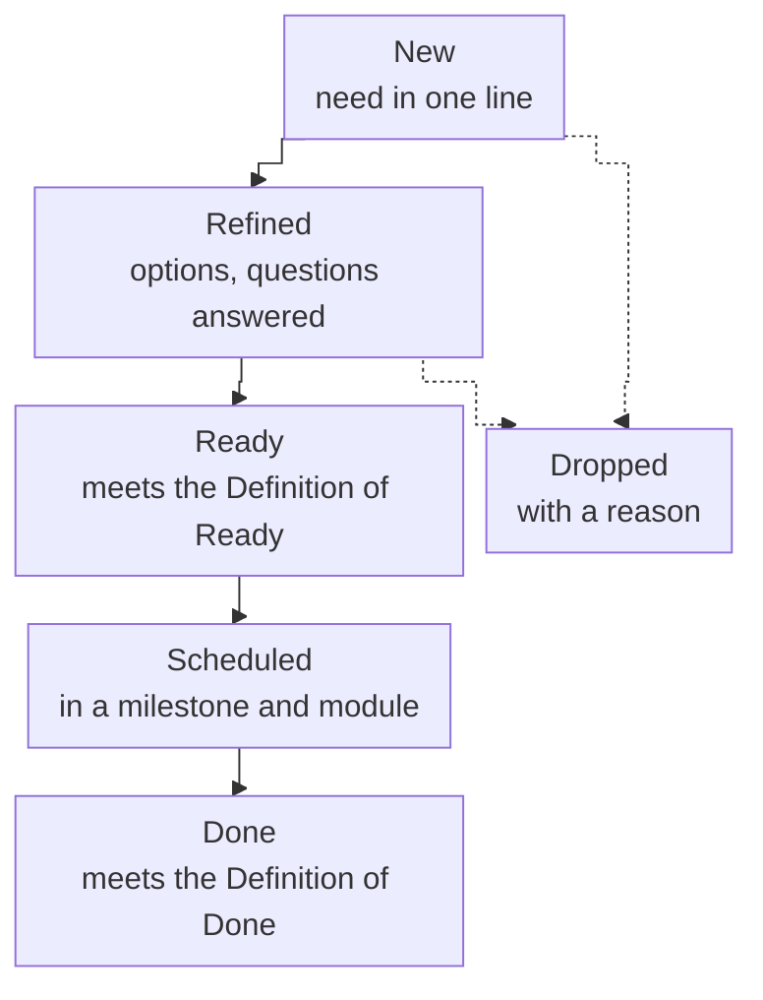

# 22 Product Backlog

Back to [[00 Project Home]] · Phase: Plan, scope · Owned by M0 – Project Management ([[02 Working Agreement]] §4) · Vision in [[10 Product Vision]] · Scheduled work in [[21 Roadmap]]

> [!abstract] What this is
> Every feature the product could get, grouped by the capability it serves ([[10 Product Vision]] §4.2). An item enters here, gets refined, and moves into a module only when M0 schedules it. Nothing here commits the project to building anything ([[03 Decision Log]] D-072). The milestone column is a proposal until the scoping of each milestone sets it.

## 1. How items move

```mermaid
%%{init: {"flowchart": {"curve": "step", "useMaxWidth": true, "nodeSpacing": 12, "rankSpacing": 25, "padding": 8, "subGraphTitleMargin": {"top": 4, "bottom": 8}}}}%%
flowchart TD
    N["New<br/>need in one line"] --> R["Refined<br/>options, questions answered"]
    R --> Y["Ready<br/>meets the Definition of Ready"]
    Y --> S["Scheduled<br/>in a milestone and module"]
    S --> D["Done<br/>meets the Definition of Done"]
    N -.-> X["Dropped<br/>with a reason"]
    R -.-> X
```
- **New:** captured as said, with the need in one line.
- **Refined:** scope, options, dependencies and open questions written, and the questions answered.
- **Ready:** meets the Definition of Ready (§1.1).
- **Scheduled:** M0 puts it in [[21 Roadmap]], in a milestone and a module, and names the owning thread.
- **Done:** meets the Definition of Done ([[02 Working Agreement]] §6).
- **Dropped:** with a line saying why. Items are never deleted.
- **On hold:** at your request, at any status. The item keeps its status, is marked "on hold", and stays out of scoping until you reopen it.

IDs never change: capabilities E-01 onward, features B-001 onward. Next free: **B-037**.

### 1.1 Definition of Ready
- [ ] The need is one sentence from your side, tied to a need or goal in [[10 Product Vision]] §2.
- [ ] Scope, options and open questions are written, and the questions answered.
- [ ] It fits in one module.
- [ ] "Done when" is written as acceptance criteria you'd accept; they become user stories in [[20 Product Requirements]] §3.1.
- [ ] Dependencies are named, and none blocks it.
- [ ] The owning thread is named.
- [ ] It passes the data boundary (D-018).

### 1.2 Types and priority
- **Types:** *Feature* (new behaviour), *Content* (sources or pages in the vault), *Chore* (a fix or tidy-up with no new behaviour), *Doc* (a project document).
- **Priority:** set when a milestone is scoped, with MoSCoW (Must, Should, Could, Won't this time). Ties go to the item that moves the North Star most for the least effort ([[10 Product Vision]] §3).

## 2. Backlog by capability
Milestones: **S1** Showcase · **MVP 2** Research assistant · **MVP 3** Work assistant · **MVP 4** Work-ready · **Later** ([[10 Product Vision]] §4.1).

### E-01 · Capture
Gets material in: web clips, files, Claude outputs. Needs N1, N2.

| ID | Item | Type | Milestone | Status | Depends on | Owner |
|---|---|---|---|---|---|---|
| B-001 | Office documents as sources (§3) | Feature | MVP 4 | New | Doc 36, for work files (D-018) | M3, M1 |
| B-002 | Mermaid support (§3) | Feature | — | New; on hold | — | M3 or M4 |
| B-004 | Source finder: Claude lists the primary sources for a topic, and you clip them | Feature | MVP 2 | New | B-003's capture list | M3 |
| B-005 | Phone capture and sync | Feature | Later | New | — | M1 |

### E-02 · Compile and verify
Turns sources into cited pages, with status, conflicts and trust. Needs N1, N3.

| ID | Item | Type | Milestone | Status | Depends on | Owner |
|---|---|---|---|---|---|---|
| B-003 | Claude outputs as sources (§3) | Feature | MVP 2 | Refined; direction set by D-075 | Rule in doc 31 | M3, M4, M5, M2; rule by M0 |
| B-006 | Ingest a set: several sources on one topic in one run, with one review | Feature | MVP 2 | New | D-022 revised | M3 |
| B-007 | Trust levels: one per source (for example primary, secondary, commentary, AI); a fact takes the level of its best source; shown on pages and in `/ask` | Feature | MVP 2 | New | Rule in doc 31 §2 | M3, M4; rule by M0 |
| B-008 | Conflict resolution: Claude proposes one by trust and date, you decide, and the other claim stays visible | Feature | MVP 2 | New | B-007; doc 31 §3 revised | M3, M5; rule by M0 |
| B-009 | First domain set: the UK financial system and its legal framework | Content | MVP 2 | New; started, FSMA 2000 Part 1A ingested 2026-09-28 | The test set for B-006 | You, with M3 |

### E-03 · Ask and reuse
Answers from your own sources, and keeps the good ones. Needs N2, N3.

| ID | Item | Type | Milestone | Status | Depends on | Owner |
|---|---|---|---|---|---|---|
| B-010 | Local Markdown search, once `index.md` stops scaling | Feature | Later | New | — | M4 |

### E-04 · Keep healthy
Finds what's wrong or stale before you rely on it. Need N3.

| ID | Item | Type | Milestone | Status | Depends on | Owner |
|---|---|---|---|---|---|---|
| B-011 | Page names in `log.md`, so `/drafts` can say which operation changed a page | Chore | MVP 2 | New | — | M3 |
| B-012 | Re-read check for decision pages | Feature | Later | New | B-016 | M6 |
| B-013 | A hook that enforces page status | Feature | Later | New | — | M2, M5 |
| B-014 | A scheduled weekly digest | Feature | Later | New | — | M5 |

### E-05 · Think
Holds your own conclusions and decisions. Goal: learn faster.

| ID | Item | Type | Milestone | Status | Depends on | Owner |
|---|---|---|---|---|---|---|
| B-015 | The five Claude-written insights: rewrite, keep or archive (D-068) | Chore | MVP 2 | New | — | You, with M6 |
| B-016 | The first decision page, and a routine for decisions | Feature | Later | New | — | M6 |

### E-06 · Jobs and standards
Produces work outputs to your standards. Need N4.

| ID | Item | Type | Milestone | Status | Depends on | Owner |
|---|---|---|---|---|---|---|
| B-017 | Standards library: content, inputs, template, diagram style and audience for each output, as files in the vault, specified in doc 35 | Feature | MVP 3 | New | — | New module |
| B-018 | PRD job | Feature | MVP 3 | New | B-017 | New module |
| B-019 | Stakeholder brief job | Feature | Later | New | B-017 | New module |
| B-020 | Meeting notes to decisions job | Feature | Later | New | B-017; doc 36 for work notes | New module |
| B-021 | Prioritisation reasoning job | Feature | Later | New | B-017 | New module |

### E-07 · Control and safety
Nothing changes without your say, and confidential material stays out. Need N5.

| ID | Item | Type | Milestone | Status | Depends on | Owner |
|---|---|---|---|---|---|---|
| B-022 | Data governance (doc 36), with the bank AI-tools policy (Q-004) | Doc | MVP 4 | New | — | M0 |
| B-023 | Settle Q-015: claude.ai skills that sync into vault sessions | Chore | MVP 2 | New | — | M2 |

### E-08 · Operate
Keeps running with little effort, and changes safely. Needs N1, N5.

| ID | Item | Type | Milestone | Status | Depends on | Owner |
|---|---|---|---|---|---|---|
| B-024 | One move command for a whole set into `raw/`; the deny rule stays (D-045) | Feature | MVP 2 | New | B-006 | M3 |
| B-025 | Claude commits after your review, with your approval per command; the push stays yours | Feature | MVP 2 | New | D-008 revised | M2 |
| B-026 | Project docs written straight into the vault through the desktop link, instead of files you copy | Feature | MVP 2 | New | D-028 revised | M0 |
| B-027 | Skills no longer mirrored in doc 40; it links to the skill files instead | Chore | MVP 2 | New | Your view on the mirrors ([[87 MVP Retrospective]] §3.1) | M2 to M6 |

### E-09 · Showcase and documentation
Shows the product and how it was built. Goal: show the work (D-079).

| ID | Item | Type | Milestone | Status | Depends on | Owner |
|---|---|---|---|---|---|---|
| B-028 | Case study (doc 01): problem, your role, approach, key decisions, results, lessons | Doc | S1 | New | — | M0 |
| B-029 | Public repository: a cleaned copy with a README and a licence. Keeps the system files and project docs; leaves out `raw/` (others' copyright), your notes in `mine/` and anything personal | Feature | S1 | New | D-018 check of every file | M0, M1 |
| B-030 | Demo: screenshots and a short walkthrough of one ingest and one `/ask` | Doc | S1 | New | — | M0 |
| B-031 | Success metrics (doc 12): definitions, baselines and targets per milestone | Doc | S1 | New | — | M0 |
| B-032 | Market and alternatives (doc 13): what else solves N1–N4, and why this one | Doc | S1 | New | Research | M0 |
| B-033 | Risk register (doc 04), gathering the risks now spread across doc 11 §10 and the handovers | Doc | S1 | New | — | M0 |
| B-034 | Test strategy and traceability (doc 50): user stories to tests to results | Doc | S1 | New | — | M0, with M4 to M6 |
| B-035 | Release notes (doc 60), starting with MVP 1 | Doc | S1 | New | — | M0 |
| B-036 | Operations runbook (doc 71): routines, deploy, backup, restore and rollback | Doc | S1 | New | — | M0 |

## 3. Item details
Items with more than a one-line need. Others get a section here when they are refined.

### B-001 · Office documents as sources
**Need:** much product-owner material comes as Word, Excel and PowerPoint files, and `ingest` stops on them today.
**Raised:** 2026-09-25, M0, after reviewing which formats `raw/` supports.
**Today:** `raw/` takes Markdown and PDF. Claude Code's file reader doesn't open Office files, and the `ingest` ground rules forbid saving a converted copy, because that copy would be Claude's rendering rather than the source ([[40 Claude Operating Instructions]] §4.1). So you convert by hand first.
**Options to weigh when refining:**
- **a. You save as PDF before capture.** Nothing to build, and page citations already work (D-046). Spreadsheet structure is lost.
- **b. A converter you run, not Claude, produces Markdown.** The original and the converted text both go into `raw/`, with a rule saying which one citations point at.
- **c. Claude reads Office files through an installed tool.** Needs your install (D-054), plus a citation form for a slide, a sheet or a cell.

**Open questions:** which of the three formats matter most; how a citation points into a slide or a cell.
**Constraint:** until doc 36 exists, only personal and public Office files qualify (D-018). Work files are most of the reason for this item, so its full value waits on doc 36.

### B-002 · Mermaid support
**Need:** diagrams as part of the knowledge base.
**Raised:** 2026-09-25, M0.
**Two readings, scope to confirm:**
- **Input: Mermaid scripts as sources.** A Mermaid block inside a Markdown source is already readable text. A standalone `.mmd` file is plain text too, but untested and not in the blueprint's list for `raw/` ([[32 Vault Blueprint]] §1).
- **Output: Claude draws Mermaid diagrams in wiki pages,** such as the overview, analyses or concept maps. Obsidian renders them without a plugin.

**Design question for the output reading:** a diagram is a set of claims, one per arrow. The provenance rule (D-021) needs a line for it; for example, a diagram only restates claims cited on the same page, and `lint` checks it like any other claim.
**Open question:** input, output, or both.
**On hold:** 2026-09-25, at your request. Out of MVP 2 scoping until you reopen it. The format is settled meanwhile: any diagram is Mermaid (D-073).

### B-003 · Claude outputs as sources
**Need:** save a Claude output (a chat answer, a research report, an artifact) into the vault as material the wiki can use, so nothing useful disappears into chat history ([[11 Project Charter]] §1).
**Raised:** 2026-09-26, M0, while planning how to learn the UK financial system with Claude as the main research tool.
**Why a rule is needed:** saved and ingested as it is, a Claude output would be cited like any other source, and pages could turn `verified` on Claude's say-so: the circular evidence [[31 Trust and Provenance]] exists to prevent. Yet a summary can be true even when it names no source.
**Direction:** option c, both ways, decided 2026-09-27 ([[03 Decision Log]] D-075).
- **Map (works today):** the output is kept in `mine/projects/<topic>/`, already named `claude-<YYYY-MM-DD>-<topic>.md` with `origin: claude`, `source-type: ai` and its chat link, so it can move straight into `inbox/sources/` once the source path is built. Meanwhile only the primary sources it cites are ingested. Not `inbox/sources/`, where `/ingest` would treat it as an ordinary source, and not `mine/scratch/`, which the weekly review empties.
- **Source (to build):** the output is saved into `inbox/sources/` and run through `/ingest` like any source, verified claim by claim.

**Design for the source path**
1. **Mark it.** File named `claude-<YYYY-MM-DD>-<topic>.md`, with `source-type: ai` and the chat link in its properties. `/ingest` asks when a file reads like AI output but carries no mark.
2. **Verify each claim** at ingest, before anything is written:
   - Found in `raw/` → cites that raw file, not the Claude output.
   - Not in `raw/` → Claude searches the web for the primary source and adds it to a capture list for the user to clip. The web page itself is never evidence, and nothing is fetched into the zone (D-043).
   - Contradicted by `raw/` → left out of the wiki and reported in the brief.
   - Still unbacked → kept, citing the Claude output, labelled "(AI)".
3. **Status.** An "(AI)" claim counts as uncited, so its page is `unverified` and shows in Needs attention. No new status.
4. **Upgrade.** When a source from the capture list is ingested, `/ingest` re-cites the matching "(AI)" claims to it and drops the label.
5. **Checks.** `/lint` lists every "(AI)" claim still waiting for a primary source; `/ask` names them under Caveats.

**Owners when built:** the rule in doc 31 (M0); `CLAUDE.md` and `system/conventions.md` (M2); `ingest` (M3); `ask` (M4); `lint` (M5).
**To settle in the building thread:** where the capture list lives between sessions (for example, lines in `inbox/checks.md`); whether web search needs an allow rule, since manual mode asks before each search; a size limit for long research reports.
**Constraint:** the output must pass the same data boundary as any source (D-018).
