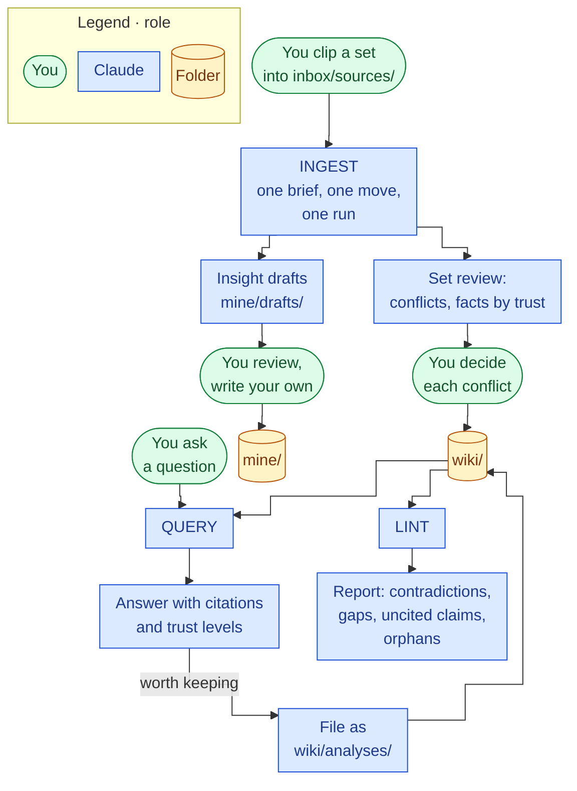

# 30 System Architecture

Back to [[00 Project Home]] · Related: [[31 Trust and Provenance]] · [[32 Vault Blueprint]] · [[40 Claude Operating Instructions]]

## 1. The pattern we adopted
From Karpathy's LLM Wiki idea file. Rather than retrieving from raw documents each time a question is asked, the assistant compiles those documents once into a maintained wiki and keeps it current. The knowledge accumulates instead of being re-derived, and the cross-references and contradictions are already there when you ask.

His summary of the roles fits this project exactly: Obsidian is the IDE, the LLM is the programmer, the wiki is the codebase.

## 2. Three layers
| Layer | Folder | Who writes | Who reads | Contents |
|---|---|---|---|---|
| **Raw sources** | `raw/` | You | Claude | Clipped articles, PDFs, notes, images. **Immutable:** Claude reads them and never changes them. |
| **The wiki** | `wiki/` | Claude | You | Source summaries, entity pages, concept pages, analyses, all cross-linked |
| **The schema** | `CLAUDE.md` plus `system/` | Both, over time | Claude | How the vault is structured and how the operations work |

## 3. What we add on top
| Addition | Why |
|---|---|
| **A thinking layer you own** (`mine/`) | The wiki records what your sources say. It has no home for what *you* conclude. Insights, decisions, and project notes live in `mine/`, where Claude can only leave drafts in `mine/drafts/`. |
| **Provenance rules** | Every wiki claim cites a source in `raw/`. Uncited claims are marked unverified. This stops Claude's own summaries from becoming evidence for later summaries ([[31 Trust and Provenance]]). |
| **Insight extraction at ingest** | Each ingest also proposes 1–3 single-idea drafts into `mine/drafts/`, so reading feeds your thinking layer, not only the reference layer. |
| **Trust levels and a conflict review** | Every source has a level set by its type: primary, secondary, commentary or AI. A fact carries the level of its best source, and when sources disagree Claude proposes and you decide ([[31 Trust and Provenance]] §2.1, §3; added in M7). |
| **An enforcement layer** | Permission rules and git, so the zones hold in practice and every change can be undone ([[40 Claude Operating Instructions]]). |
| **A one-page Obsidian reference** | Just the Obsidian this system needs, picked up while building; no curriculum ([[70 Obsidian Essentials]], D-026). |
| **Product-owner workflows** | After the MVP: meeting notes to decisions, stakeholder briefs, prioritization reasoning: now jobs and standards, MVP 3 ([[10 Product Vision]] §4.1). |

## 4. Components
| Layer | Component |
|---|---|
| Memory | The vault: a git repository of Markdown files on your PC, pushed to a private GitHub repo (D-030) |
| Reading surface | Obsidian |
| Reasoning and maintenance | Claude Code, started inside the vault (Windows Terminal, or the Code tab in Claude Desktop) |
| Navigation | `index.md` (a catalog of every page) and `log.md` (an append-only history) |
| Rules | `CLAUDE.md`, which imports `system/context.md` and `system/conventions.md` |
| Procedures | Claude Code skills: `ingest`, `ask`, `file-answer`, `lint`, `drafts` |
| Enforcement | `.claude/settings.json` permission rules, plus git history |

> [!important] Claude on the web or phone can't see your vault
> Only Claude Code running on the PC can. You can still plan on your phone, as in this thread.

## 5. The three operations

Each operation has its own input zone, so the three never mix: see [[33 Input Zones]].

**Ingest.** You clip a set of sources on one topic into `inbox/sources/` and run `/ingest`. A set is up to 8 files; one file is a set of one.
1. Claude reads the set and sends one brief: each source's trust level, the takeaways, the pages it would touch and the likely conflicts.
2. You paste one move block, which puts the files in `raw/`, and say what to emphasise.
3. Claude compiles every source without another stop, strongest sources first: a summary page per source, every entity and concept page they touch, each conflict shown on both sides with a proposal, insight drafts, `index.md` and `log.md`.
4. One set review lists the conflicts first, then the facts, weakest sources first. You decide each conflict with `/ingest resolve`.
5. When you say the review is done, Claude commits with your approval. The push is yours.

A set of five sources touched 28 pages in M7's test, so the review is where you stay involved ([[33 Input Zones]] §2; [[03 Decision Log]] D-085 to D-090).

**Query.** You ask a question. Claude reads `index.md`, opens the relevant pages, follows links, and answers with links to pages and citations to sources, each with its trust level. A good answer can be filed back as an analysis page, so your explorations compound the same way your reading does.

**Lint.** Periodically, Claude health-checks the wiki: contradictions between pages, claims a newer source has superseded, pages with no citation, trust markers that don't match their source, orphan pages, concepts mentioned but missing a page, gaps worth finding a source for. It reports; you decide.

## 6. Why an index file instead of a search engine
At this scale, a catalog file that Claude reads first is enough to find the right pages, and it avoids running any embedding or vector infrastructure. If the wiki outgrows it, a local Markdown search tool such as qmd can be added later. That's a Phase 5 question, not an MVP one.

## 7. Three layers of control
| Layer | What it does | How strong |
|---|---|---|
| Instructions (`CLAUDE.md`, skills) | Tell Claude how to run each operation | Guidance. Usually followed, never guaranteed. |
| Permission rules (`.claude/settings.json`) | Allow writes in `wiki/`, `mine/drafts/`, `system/lint/`, `system/ingest/`, the two queue files, `index.md` and `log.md`; ask for everything else, and for every commit; block edits to `raw/`, deletions and pushes | Enforced by the software |
| Git | Records every change for review and rollback | The safety net |

## Sources
- LLM Wiki pattern: https://gist.github.com/karpathy/442a6bf555914893e9891c11519de94f
- CLAUDE.md, imports, auto memory: https://code.claude.com/docs/en/memory
- Permission rules and modes: https://code.claude.com/docs/en/permissions
- Claude Code setup on Windows: https://code.claude.com/docs/en/setup
