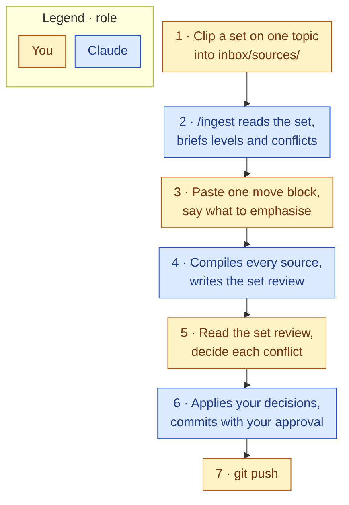

# 33 Input Zones

Back to [[00 Project Home]] · Operations in [[30 System Architecture]] §5 · Commands in [[40 Claude Operating Instructions]]

> [!abstract] The idea
> Each operation gets its own door. Material for compiling, questions waiting to be asked, and things you want checked never mix, so an operation always knows exactly what it is being handed. Everything is triggered inside Claude: three commands in a Claude Code session, no other tooling.

## 1. The three zones
```
inbox/
├── sources/        → /ingest   files to compile
├── questions.md    → /ask      questions for the wiki
└── checks.md       → /lint     things to verify or re-check
```

| Zone | What you put there | Command | Where the result goes |
|---|---|---|---|
| `inbox/sources/` | Clipped articles, PDFs, notes, saved as files | `/ingest` | `wiki/` pages, a set review in `system/ingest/`, insight drafts in `mine/drafts/`, entries in `index.md` and `log.md`; the source files move to `raw/` |
| `inbox/questions.md` | One question per line, dated | `/ask` | An answer in the session; optionally a page in `wiki/analyses/` |
| `inbox/checks.md` | "verify X", "this page feels stale", "did source 3 contradict source 1?" | `/lint` | `system/lint/report-YYYY-MM-DD.md`, plus the standing checks |

**One rule holds all three together:** a command reads only its own zone, and no zone ever triggers itself. Material can sit in a zone for a week; nothing happens until you run the command.

**Queue format.** `questions.md` and `checks.md` hold one item per line as a checkbox: `- [ ] YYYY-MM-DD text`. The command ticks an item off (`- [ ]` becomes `- [x]`) once it has handled it. Each file's first lines describe the format and are not items.

## 2. Zone 1: sources → `/ingest`
**What goes in:** anything you want compiled, saved as a file: a Web Clipper clipping (it saves straight to `inbox/sources/`), a downloaded PDF, or a note. Don't ask Claude to fetch a link into the zone. Its web fetch returns a model-processed version of the page, not the page itself, so `raw/` would end up holding Claude's rendering instead of the source ([[03 Decision Log]] D-043). Claude's edit rights in `inbox/` cover only the two queue files, so a captured source can't change before it reaches `raw/` (D-032).
**Contract:** one file per source, and one set per ingest: every file in the zone, or the files you name, up to 8 on one topic ([[03 Decision Log]] D-085; it replaces D-022's one source per run when M7 exits). A set of one file is an ordinary single ingest.
**What `/ingest` does** (the `ingest` skill, mirrored in [[40 Claude Operating Instructions]] §4.1):
1. Reads every file in the set, then sends one brief: a row per source with its trust level and proposed raw name, key takeaways for the set, the pages it would touch, likely conflicts, anything suspicious in the text, and one move block. It asks what to emphasise and whether any level should change. Nothing is written until you answer.
2. You paste the move block once at the vault root and press Enter, because PowerShell holds the last pasted line until you do. `raw/` stays enforced read-only to Claude, shell moves included, so the move is yours (D-045, D-089). Claude checks every file arrived.
3. Opens the set review, `system/ingest/set-YYYY-MM-DD.md` (D-086), then compiles each source in turn, primary sources first: the source page with its `trust`, the entity and concept pages it touches, and each conflict on both sides with a proposal ([[31 Trust and Provenance]] §2.1, §3). It ticks each source in the set review as it goes, so a run that stops can resume.
4. Rewrites `wiki/overview.md` once (D-044), proposes one to three insight drafts for the set, updates `index.md` and `log.md` with the pages named (D-091), and finishes the set review: conflicts first, then facts sorted by trust, weakest first, and one claim per level for you to trace.
5. You read the set review and decide each conflict with `/ingest resolve 1a 2d` (D-088). When you say the review is done, Claude commits with your approval, and the push stays yours (D-090).


Four steps are yours per set, where MVP 1 took three per source: 4 instead of 15 for five sources ([[87 MVP Retrospective]] §5).

**Done when:** none of the set's files is left in the zone, every citation points at a file in `raw/`, and every conflict in the set review has your decision.

## 3. Zone 2: questions → `/ask`
**What goes in:** questions you want the wiki to answer, one per line as `- [ ] YYYY-MM-DD question`. Add them whenever they occur to you, especially while reading what an ingest produced.
**Why a queue when you could just ask:** asking directly in a session is still the normal path. The queue is for questions that arrive when you're not at the PC, and it keeps a record of what you've been curious about, which is useful raw material later.
**What `/ask` does** (the `ask` skill, [[40 Claude Operating Instructions]] §4.2): answers the question you typed after the command or, failing that, the oldest unticked one. It reads `index.md`, searches `wiki/`, answers with links and with evidence traced to `raw/`, and ticks the question off. It writes nothing else ([[03 Decision Log]] D-048).
**Filing:** if the answer is worth keeping, run `/file-answer` in the same session (§4.3 of doc 40). It re-checks the evidence in `raw/`, writes `wiki/analyses/<title>.md`, links it from the pages it drew on, and updates `index.md` and `log.md` (D-050, D-051).

## 4. Zone 3: checks → `/lint`
**What goes in:** anything you want verified or re-examined, one per line as `- [ ] YYYY-MM-DD what to verify`. A page that felt thin, a claim you doubt, a topic you suspect has gaps.
**What `/lint` does** (the `lint` skill, [[40 Claude Operating Instructions]] §4.4): runs the standing checks from [[31 Trust and Provenance]] — contradictions, superseded claims, uncited claims and claims whose cited passage doesn't say them, orphan pages, missing cross-references, pages not updated in six months — and then works through your queued checks, ticking off each one it covers with `→ report-<date>`. It writes a numbered report in `system/lint/` and changes nothing in `wiki/`.
**Fixing:** `/lint apply <numbers>` makes the fixes you name from the report, and only those ([[03 Decision Log]] D-055).
**Rhythm:** weekly, as part of the review in [[70 Obsidian Essentials]] §4.

## 5. Using Claude as the platform
- All three commands are Claude Code skills, run in a session started in the vault. No plugins, no scripts, no separate app.
- The Code tab in Claude Desktop runs the same engine if you'd rather have a window than a terminal.
- **Away from the PC:** a chat in the "Obsidian x Claude" Project can't reach the vault; it sees only the project documents synced from `mine/projects/thinking-system/`. Use it to think and to draft, then paste anything worth keeping into the right zone at your next local session. Treat the Project chat as a fourth, informal zone with no automation behind it.

## 6. When something lands in the wrong zone
Claude doesn't guess. If a question turns up in `inbox/sources/`, or a source link in `inbox/questions.md`, it says so and asks you to move it. Silent re-routing would undo the whole point of separating the doors.
