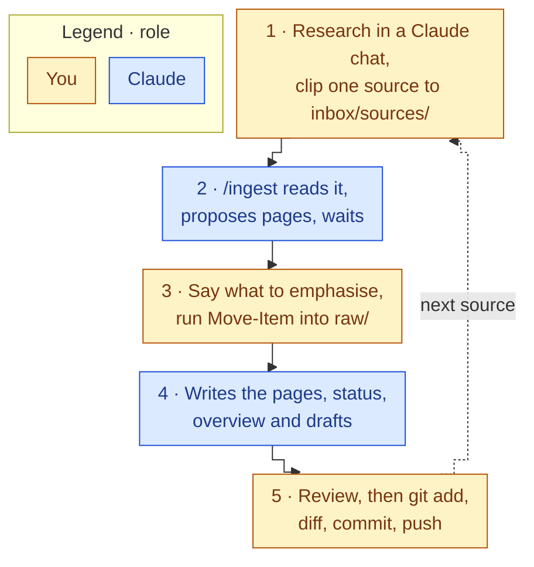
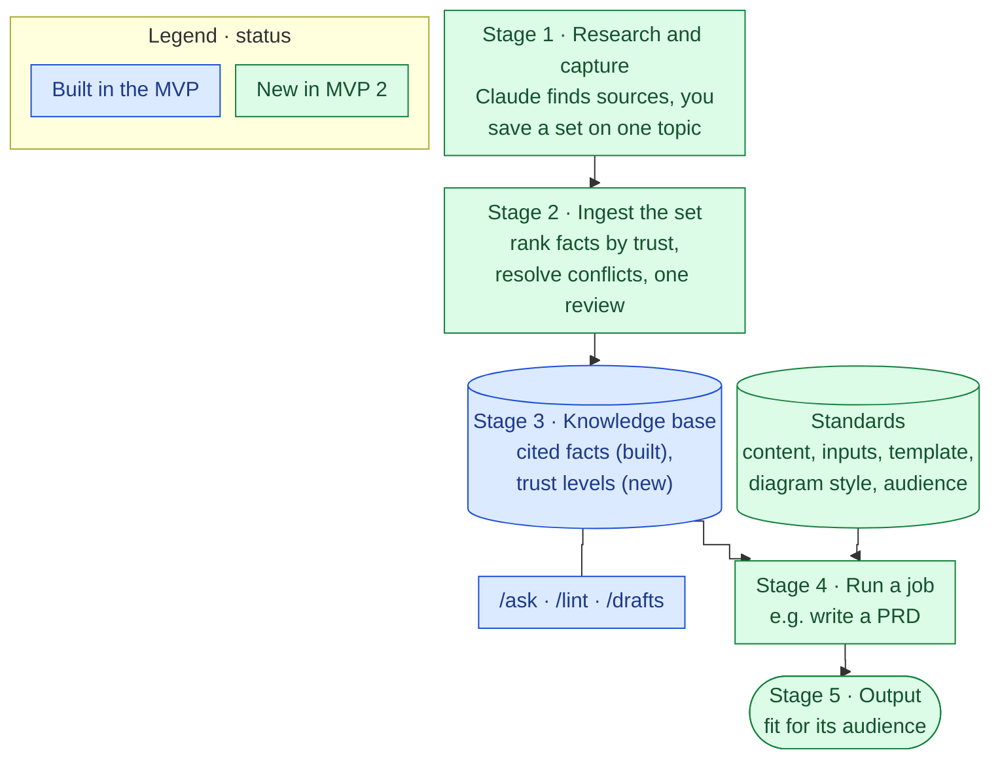

# 87 MVP Retrospective

Back to [[00 Project Home]] · Plan in [[21 Roadmap]] · Backlog in [[22 Product Backlog]] · Owned by M0 – Project Management ([[03 Decision Log]] D-070)

> [!abstract] What this is
> The retrospective that [[02 Working Agreement]] §4 calls for at the end of a phase, covering the MVP (M0–M6), and the input to MVP 2's scope.
> - **§1–§3, the record:** compiled from handovers 80–86 and `system/test-results.md`, plus what changed since the MVP closed.
> - **§4–§6, your view:** your input, wording tightened by Claude.
> - **§7, what it means for MVP 2:** themes, a candidate direction, the tensions with current decisions, and the decisions MVP 2 needs.
> - **§8, the outcome:** filled in by the M0 thread once you accept MVP 2's scope.

## 1. What was built
| Module | Dates | Delivered | Exit evidence |
|---|---|---|---|
| M0 – Foundation | 2026-09-16 → 19 | Documents 00, 02, 03, 11, 21, 30–33, 40, 70 and 80; the LLM Wiki pattern adopted | Documents accepted; D-001 to D-025 |
| M1 – Vault and Git | → 2026-09-21 | Obsidian vault, folder structure, git pushed to `second-brain`, Web Clipper | Structure matches the blueprint; first commit |
| M2 – Connect Claude Code | 2026-09-21 → 22 | Claude Code, `CLAUDE.md`, permission settings, eight templates | Setup checks and the permission smoke test pass |
| M3 – First Ingests | 2026-09-22 | The `ingest` skill; 5 sources; the wiki compiled | Source 5 updated 6 existing pages, against a bar of 3 |
| M4 – Ask and File-back | 2026-09-24 | The `ask` and `file-answer` skills; the first analysis page | Test prompts 10 of 10 |
| M5 – Lint and Review | 2026-09-24 | The `lint` skill; two review views; the weekly review | Lint tests 6 of 6; 16 fixes applied |
| M6 – Thinking Layer | 2026-09-24 → 25 | The `drafts` skill; the drafts routine; 5 insights (`origin: claude`) | Drafts tests 5 of 5 |

**Outcome:** MVP complete on 2026-09-25, 6 of 6 criteria in [[11 Project Charter]] §6 met, nine days after the first document (2026-09-16).

**The vault at MVP close (2026-09-25):**
- 5 sources in `raw/`.
- 27 wiki pages: 19 `verified`, 7 `contested`, 1 `unverified`. One is an analysis page.
- 2 lint reports.
- 5 skills: `ingest`, `ask`, `file-answer`, `lint`, `drafts`.
- 5 insights, all written by Claude.
- Nothing yet in `mine/decisions/`, `mine/journal/` or `mine/scratch/`.

**The project record:** 21 of 21 tests passed. 66 decisions logged (D-001 to D-071). 42 commits.

## 2. What the system caught in itself
- **M4, test 8.** `/file-answer`'s re-check found that "Resources rank below Projects and Areas" isn't in the Forte source, although two wiki pages said it. The first error the system caught in itself.
- **M5, lint.** The first run reported 14 findings, 13 of them real: two misquotes of Bush, unsupported claims, missing links. The fourteenth came from the skill's own wording and was fixed in the skill. The second run found 3 more real problems on pages the first run had passed, which led to D-060: a full deep check once a month.
- **M6, drafts.** 9 of the 11 insight drafts had problems, and every finding held against `raw/`. One draft presented Karpathy's point as its own reasoning.
- **Pattern:** the checks that open `raw/` catch what summaries miss. Every error found so far sat in Claude-written synthesis (drafts, claims that span pages), not in the sources.

## 3. Where the plan changed
| Decision | Change | Why |
|---|---|---|
| D-026 | The Obsidian curriculum was removed | Speed: steps, not lessons |
| D-030 | The documents repo was folded into the vault repo | One master copy |
| D-045 | You move each source into `raw/` | The permission rule held against Claude's shell too |
| D-062, D-068 | The insights criterion moved to M6, then was met with insights Claude wrote and you accepted | MVP first; revise before MVP 2 |
| D-069 to D-071 | The revision runs in M0, and every module thread is standing | Planning is project management; threads keep their module's context |

### 3.1 What Claude observed while building
| Observation | Your view |
|---|---|
| **File placement.** Every change reaches the vault as files you copy, diff, commit, push and sync. M6 alone took four rounds. | **Confirmed:** manual pushes are part of what §5 calls too heavy |
| **Mirrors.** Each skill and `CLAUDE.md` is mirrored in doc 40, so every skill change is two edits in one commit. | Open |
| **The thinking layer.** `mine/` holds no page you have written. The five insights are Claude's; `decisions`, `journal` and `scratch` are empty. | Open: decisions 1–3 in §7.4 |
| **Stale files.** `system/context.md` said "M3" until M6, and Q-015 has been open since 2026-09-22. | Open: decision 7 in §7.4 |
| **The wiki.** It covers knowledge systems, not your domains. D-039 left your domains (lending, cards, payments, onboarding) to the next iteration. | **Partly confirmed:** the UK financial system and its legal framework is the first domain topic you named (M0 chat, 2026-09-26) |

### 3.2 Since the MVP closed
| Date | Change | Record |
|---|---|---|
| 2026-09-25 | Needs wait in a product backlog before they reach the roadmap. 3 items so far; the backlog is on hold until scoping | D-072, [[22 Product Backlog]] |
| 2026-09-26 | Every diagram is Mermaid, drawn to fixed rules: your first written standard for an output | D-073, D-074, [[02 Working Agreement]] §8 |
| 2026-09-26 | The whole system written up for a newcomer: in effect, the project's first PRD | [[20 Product Requirements]] |
| 2026-09-27 | Claude outputs can be sources, verified claim by claim at ingest | D-075, B-003 |

## 4. What worked for you
*Your input, 2026-09-29.*
- **Citations.** Turning sources into facts works: every fact is backed by a source I can verify, and the page states the outcome directly.

## 5. What didn't fit how you work
*Your input, 2026-09-29.*
1. **Ingest is too heavy for how research works.** Today, per source: I research and save a file into `inbox/sources/`, run `/ingest`, and push to git by hand before the knowledge is reusable. On a new topic, a researcher saves several files at once, summarises them, sorts the facts by how trustworthy they are and finds the conflicts, then resolves the conflicts and verifies the facts, keeping each fact's trust level.
2. **Too few input formats.** Sources are limited to PDF and plain-text files such as Markdown.

Today's loop, drawn from the `ingest` skill: 3 of 5 steps are yours, repeated for every source.

## 6. What you want the system to do for your real work
*Your input, 2026-09-29, at a public level: no employer, product, team or internal detail (D-018).*
- **Today:** a chat-based knowledge base I use to take in and store knowledge.
- **What I want:** a personal assistant that does defined jobs to my standards, using the knowledge base. Example: for a Product Requirements Document, it knows which contents to include, what inputs it needs, the template, the chart and diagram style, and how to shape the output for its audience.
- **Learn a new domain with Claude as my main research tool,** for example how the UK financial system and its legal framework work. *(Added by Claude from your M0 chat, 2026-09-26. Delete it if it doesn't belong here.)*

## 7. What this means for MVP 2
Claude's reading of §1–§6. Nothing here is decided until §8 records it.

### 7.1 Themes
| # | Theme | From | What it would change | Backlog |
|---|---|---|---|---|
| T1 | **Keep provenance at the core.** Every fact traces to a source you can check, and pages state the outcome plainly | §4, §2 | Nothing. It's the test every other theme must pass: the checks that open `raw/` caught every error so far | — |
| T2 | **Research a topic as a set.** Ingest several sources at once, rank facts by trust, surface conflicts, resolve them in one review | §5.1, §6 | `ingest` works on a set; doc 31 gains trust levels and a way to resolve conflicts; the review views | B-003 (in part); new item to log |
| T3 | **Fewer manual steps.** Moves, commits, and placing project files | §5.1, §3.1 | Who runs each step in the loop above; D-008, D-028, D-045 | New item to log |
| T4 | **More input formats** | §5.2 | `ingest` and the rules for `raw/` | B-001 |
| T5 | **From knowledge base to assistant.** Defined jobs that follow your standards, a PRD first | §6 | A job = a procedure + your standards (contents, inputs, template, diagram style, audience) + the wiki. Replaces the old doc 35 plan | New item to log |
| T6 | **Your domains in the wiki** | §3.1, §6, D-039 | The first domain sources, e.g. the UK financial system | — |

New items go into [[22 Product Backlog]] when you reopen it (D-072).

### 7.2 Candidate direction
**Candidate goal:** turn the knowledge base into an assistant: research a topic in one pass with trust-ranked, verified facts, and produce defined work outputs to your standards, starting with a PRD.

**Possible build order,** to settle in [[21 Roadmap]]:
1. **Research sets** (T2, T3, with B-003's source path, since Claude is your main research tool). Tested on a first domain set (T6), such as the UK financial system, so the test also fills the wiki with your subject.
2. **Standards and the first job** (T5): a standards library and a PRD job, tested on public material, with doc 20 as the reference example.
3. **Formats** (T4, B-001). Meanwhile, save Office files as PDF (B-001 option a).

Doc 36 comes before any job or source uses work material (D-018).

### 7.3 Tensions with current decisions
| Decision | Says today | MVP 2 pull | Options |
|---|---|---|---|
| D-022 | One source per run, and you read each result, "at least through M3" | A set per run (T2) | One review per set. The "through M3" clause already allows it |
| [[31 Trust and Provenance]] §2 | Status records whether claims are cited, not how trustworthy the source is | Rank facts by trust (T2) | A trust level per source (e.g. primary, secondary, commentary, AI) beside status; a fact takes the level of its best source; status unchanged |
| [[31 Trust and Provenance]] §3 | Claude never picks a side: both positions stay, and the page turns `contested` | Resolve conflicts (T2) | Claude proposes a resolution by trust and date, you decide, and the other claim stays visible, marked as outweighed |
| D-045 | You move each source into `raw/` | Fewer steps (T3) | One `Move-Item` for the whole set; the deny rule stays |
| D-008, D-028 | You commit after every session; project docs arrive as files you copy, commit, push and sync | Fewer steps (T3) | Claude runs `git add` and `git commit` after your review, with your approval per command, and the push stays yours; or project docs are written straight into the vault through the desktop link, and you review the diff |
| D-018 | Doc 36 before any work material | Jobs for real work (T5) | Build and test jobs on public material; write doc 36 before the first work use |

### 7.4 Decisions MVP 2 needs
**New, from §4–§6:**
9. **The goal:** the candidate in §7.2, or another.
10. **Research sets:** set size, one review per set, and what "resolve a conflict" means: you decide, or Claude proposes and you accept (D-022, doc 31 §3).
11. **Trust levels:** the tiers, where a source's level is recorded, how a fact inherits it, and how it shows on pages and in `/ask`.
12. **Manual steps:** which steps Claude takes over (moves, commits, placing project docs) and which stay yours (D-008, D-028, D-045).
13. **Jobs and standards:** the first jobs (a PRD first?), where standards live in the vault (e.g. `system/standards/`, with the D-074 diagram rules as the first file), and how a job reads them. Answers Q-008 and replaces the doc 35 plan.
14. **Formats:** which first, and which of B-001's options a to c.
15. **B-003's source path:** in MVP 2, or later.

**Carried from [[86 M6 Handover]]:**
1. The five `origin: claude` insights: rewrite them, keep them as they are, or archive them (D-068).
2. Whether D-063 stays: a kept insight means you write the page.
3. The first page in `mine/decisions/`.
4. Whether the product-owner workflows (doc 35) come into MVP 2, and which routines matter most (Q-008). Partly answered by §6: a PRD is the first job you named. See 13.
5. When doc 36 (Data Governance) is written, and your bank's AI-tools policy (Q-004). Either way, doc 36 comes before any work material (D-018).
6. The first domain sources: which of your domains the wiki covers next (D-039). The UK financial system is a candidate (§6). See T6.
7. The parked items: page names in `log.md`, a re-read check for decisions, the M5 leftovers, and Q-015.
8. The module references still to update: [[11 Project Charter]] §4, [[30 System Architecture]] §3, and the due dates on D-018, Q-004, Q-007 and Q-008.

## 8. Outcome
Filled in by the M0 thread once you accept MVP 2's scope: the goal, scope and module plan, the decision IDs, and the revised docs 11 and 21.
