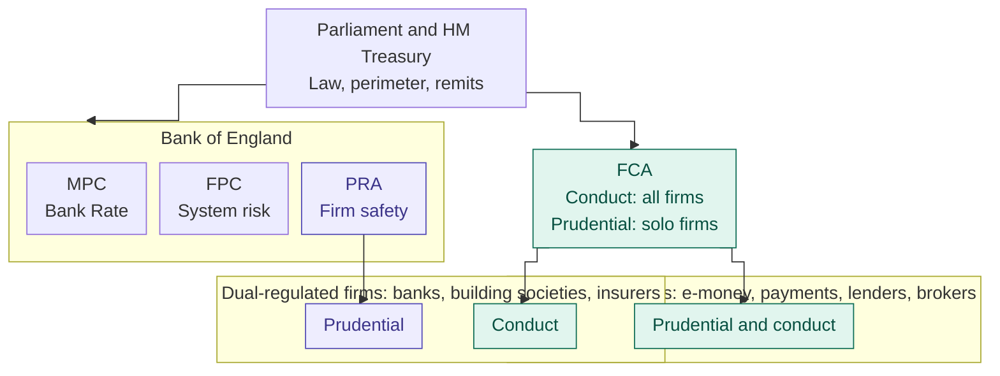

**Foundations | 1. The system map › Phase overview and 1.1 Who regulates what**

## Domain 1 sub-topics

| # | Sub-topic | Covers | The product question it answers |
|---|---|---|---|
| 1.1 | Who regulates what | HM Treasury; the Bank of England (MPC, FPC, PRA); the FCA; objectives; dual vs solo regulation | Whose rules shape this product, and who can stop it? |
| 1.2 | Payments, competition and data regulators | The PSR and its move into the FCA; the CMA; the ICO; where they overlap | Who governs the rails, fees and data my product depends on? |
| 1.3 | Redress and protection | Financial Ombudsman, FSCS, and the reforms now before Parliament | Where does a complaint end, and what is protected if a firm fails? |
| 1.4 | The industry layer | UK Finance, BSA, Pay.UK, Open Banking Limited, LSB, Cifas; codes vs rules | Which standards bind us even though they aren't law? |
| 1.5 | Firm types and permissions | Bank, building society, EMI, PI, consumer credit firm; the perimeter; new bank authorisation; BaaS and agency models | What licence does this business model need, and what does it allow? |
| 1.6 | Market structure and ring-fencing | Big Five, Nationwide, challengers, specialist lenders, BaaS providers; ring-fencing | Who are we competing with, and what structural rules shape them? |

After 1.6 comes the deliverable: a one-page map, a "who would I deal with?" matrix for ten scenarios, and a Vietnam ↔ UK comparison. Then a review of the draft and a test.

## 1.1 Who regulates what

### Summary (own words)

The UK divides financial regulation by purpose rather than by type of firm. 

+ Parliament makes the law
+ HM Treasury owns the framework: decides which activities need a licence (the perimeter)
	+ formally tell the regulators what it wants them to weigh.
+ The Prudential Regulation Authority (PRA), part of the Bank of England, asks whether a firm is safe: does it have enough capital and liquidity, is it soundly managed, and can it keep running through a shock? (Firm-wellness management)
+ The Financial Conduct Authority (FCA) asks whether customers are treated fairly and whether markets work. Firms that take deposits or write insurance answer to both regulators. Almost everyone else answers only to the FCA. 
+ The Monetary Policy Committee sets Bank Rate, 
+ The Financial Policy Committee acts on risks to the system as a whole. 
### How the layers fit

The backbone is the Financial Services and Markets Act 2000 (FSMA). 
Section 19 sets the "general prohibition" on carrying on a regulated activity without being authorised or exempt.
Section 23 makes breaching it an offence.[^fsma] HM Treasury lists which activities count in secondary legislation. The two-regulator model dates from 1 April 2013, when the FCA took over conduct and relevant prudential regulation from the Financial Services Authority.[^fca-about] That followed the 2007–08 crisis, which showed that no single body clearly owned financial stability. FSMA 2023 began moving EU-derived law into the regulators' own rulebooks and gave both regulators a secondary objective on growth. For the FCA, this means that since 2023 it must also facilitate the UK economy's international competitiveness and medium-to-long-term growth.[^fca-about]

The core of the map is below. Redress, competition, data and industry bodies are added in 1.2 to 1.4. Purple marks the PRA's prudential role and teal the FCA's role.

What each body does, and where you meet it:

| Body | Its job in law | Where you feel it as a product owner |
|---|---|---|
| HM Treasury | Owns the framework and the perimeter; can send formal recommendations to the FCA (FSMA s1JA) | Decides whether a product type is regulated at all. For example, it legislated to bring interest-free BNPL into regulation, and the FCA's rules have applied since 15 July 2026 |
| MPC | Sets Bank Rate to meet the government's 2% inflation target | Moves the pricing of almost every savings and lending product (Domain 2) |
| FPC | Identifies and acts on risks to the financial system as a whole | System-wide limits, such as the cap on the share of new mortgages at high loan-to-income multiples (Domain 10) |
| PRA | Safety and soundness of the firms it regulates (s2B), with secondary objectives on competition and growth (s2H) | The capital and liquidity your product uses up; operational resilience; restrictions on new banks while they build up |
| FCA | Making markets work well through consumer protection, integrity and competition (ss1B–1E), plus the growth objective (s1EB) | Product design, pricing and value, communications, promotions, complaints and the Consumer Duty; also prudential rules for solo-regulated firms |

The PRA's reach is narrow but deep: it is the prudential regulator for around 1,500 banks, building societies, credit unions, insurers and major investment firms.[^fca-about] The FCA's conduct remit covers tens of thousands of firms.

### Dual-regulated vs solo-regulated

For banks, building societies, credit unions, insurers and large investment firms, the PRA is the prudential regulator and the FCA is the conduct regulator, and the two share information and coordinate.[^fca-sup] So Monzo and Starling, as banks, must meet PRA capital and liquidity requirements and FCA conduct standards. 
Wise's UK e-money business, payment institutions and non-bank lenders deal only with the FCA, which sets both their prudential and their conduct rules. The distinction shapes the business model. A bank can lend out deposits and offer FSCS protection, whereas an e-money institution must safeguard customer money and cannot lend it. Sub-topic 1.5 goes through the options.

### Working with two regulators

The Act builds in the coordination:[^fsma]

- a duty on the FCA and PRA to coordinate (s3D)
- a memorandum of understanding between them (s3E)
- separate FCA and PRA routes for giving permission (ss55E and 55F)
- a PRA power to require the FCA to refrain from specified action (s3I).

When the PRA authorises a bank, it needs the FCA's consent. In practice, a product owner rarely talks to a regulator directly. Regulatory Affairs or Compliance owns the relationship, and Finance and Treasury own the capital conversation. Your job is to make the product explainable to both regulators.

Two things can stop a launch outright:

- **Missing permission.** If the product needs a regulated activity your firm has no permission for, you need a variation of permission. That can take months, so it belongs on the critical path from day one.
- **Notification duty.** Firms must tell their regulators anything the regulators would reasonably expect to know (FCA Principle 11, PRA Fundamental Rule 7). That can include a significant new product or a risky change programme.

### Vietnam ↔ UK

The SBV is a ministerial-level agency of the Government. It acts as the central bank and also carries out state management of monetary, banking and foreign exchange activity. Its aims cover currency stability, safe and sound banks, and a safe, efficient national payment system.[^sbv] In Vietnam, one relationship therefore covered your licence, prudential ratios, lending rules and caps on short-term deposit rates. For years it also covered each bank's annual credit growth limit.

Three things change in the UK:

- **Split questions.** The PRA and FCA each ask different things, and each can say no.
- **Independence.** UK regulators are operationally independent. HM Treasury steers them through legislation, recommendation letters and appointments, not day-to-day direction. The SBV, by contrast, sits inside the Government.
- **No quotas or caps.** There are no credit growth quotas and no rate caps on mainstream products (high-cost short-term credit is the exception). Growth is limited by capital, risk appetite and the Consumer Duty's price and value outcome.

So pricing and volume choices that the SBV used to bound for you become product decisions. You must justify them to your own committees and, if asked, to the FCA.

### Case: TSB's 2018 migration, one incident, two regulators

*What happened.* TSB was split off from Lloyds Banking Group in 2014 and bought by Sabadell in 2015. Over the weekend of 20–22 April 2018, it moved most of its operations and customer data from the Lloyds platform to a new platform built by a Sabadell IT subsidiary.[^tsb-facts] The data moved successfully, but the platform failed at once, disrupting branch, telephone, online and mobile banking. All branches and a large share of the 5.2 million customers were affected, and normal service only returned in December 2018. In December 2022 the FCA fined TSB £29.75m and the PRA fined it £18.9m. The total of £48.65m was after a 30% settlement discount.[^tsb-release]

*How each regulator framed it.* The FCA found breaches of two Principles:[^tsb-breaches]

- **Principle 2** (due skill, care and diligence), mainly in overseeing the outsourcer and in a testing decision.
- **Principle 3** (organising and controlling the programme with adequate risk management).

The FCA also counted the customer cost: 225,492 complaints within a year, about £32.7m in redress, and weak plans for identifying vulnerable customers during a long incident.[^tsb-breaches] The PRA saw the same events as a safety-and-soundness failure. The Bank's release points out that governance, operational risk, business continuity and outsourcing management have long been part of prudential rules. The PRA said it expects firms to manage operational resilience as well as financial resilience.[^tsb-release]

*Three lessons for a product owner* (all from the FCA notice):[^tsb-lessons]

- **A date-driven plan.** The plan was built backwards from a target date, and TSB publicly committed to a new migration window before its re-plan was finished.
- **A "technical" decision that wasn't.** A cut to one type of performance testing was treated as purely technical and decided outside the proper governance forum. That testing would probably have caught the configuration problem that later took digital banking down.
- **Capital set the clock.** To keep its internal-ratings-based capital approach, TSB had to migrate by June 2018. A successful exit was also expected to release extra capital the PRA had required because TSB relied on another bank's platform.

That last point previews Domain 2: capital economics can set the timetable that decides customer outcomes.

### Key reading (about 85 minutes)

1. FSMA 2000, Part 1A, about 25 minutes. Read ss1B–1E and 1EB (FCA objectives), ss2B and 2H (PRA objectives), and ss3D, 3E and 3I (coordination). Note which objectives are operational and which are secondary; interviewers check whether you know growth is secondary.
2. FCA Final Notice to TSB Bank plc (20 December 2022), about 50 minutes. Read section 2 (paras 2.1–2.36) for the story and both breaches, then paras 4.126–4.150 for the capital deadline and the go-live decision. Read the go-live section as if you were the product owner signing an attestation.
3. Bank of England news release on the TSB fines, notes 3–5, about 10 minutes. These show how the PRA treats operational resilience as a prudential issue.
4. Optional: the House of Lords Library briefing on the Financial Services and Markets Bill. Skim the opening pages now; we'll use it in 1.2 to 1.6.

### Changed since the principal file

1. **The PSR row in the live issues register is out of date.** It says primary legislation is still needed, but the legislation is now before Parliament:[^bill-stages]
   - The Financial Services and Markets Bill had its first reading in the Lords on 19 May 2026.
   - Second reading followed on 8 June, committee stage ran from 22 June to 8 July, and report stage ended on 9 September.
   - The Bill has been brought from the Lords to the Commons as Bill 152 of 2026–27, dated 15 September 2026.

   It is not yet law, so the PSR stays in place until the Act is passed and commenced. The Bill is also much wider than the PSR:[^bill-scope]
   - It reforms the Financial Ombudsman Service, introduces a "provisional licences" authorisation scheme and reforms ring-fencing.
   - The Lords removed a clause that would have let the Treasury amend access-to-banking legislation.
   - Linklaters expects it to affect individual accountability and consumer credit.
   - Its provisions draw on the government's growth and competitiveness strategy and its regulation action plan.

   Suggested register update: replace the PSR row with a "Financial Services and Markets Bill [HL] 2026–27" row covering Domains 1, 3, 6 and 9, with status "in the Commons; not yet law".

2. **A precision point rather than a change.** The PRA's decisions are taken by the Prudential Regulation Committee (PRC), a statutory Bank of England committee alongside the MPC and FPC. It is worth writing "Bank of England (MPC, FPC, PRA/PRC)" in Domain 1's scope.

### Glossary additions for the handover

- twin peaks
- dual-regulated and solo-regulated
- perimeter and general prohibition (FSMA s19)
- Part 4A permission and variation of permission (VoP)
- Prudential Regulation Committee (PRC)
- secondary competitiveness and growth objective
- Principle 11 and Fundamental Rule 7

## Bibliography

| Source (title, publisher, link) | Category | Trust | Checked |
|---|---|---|---|
| Financial Services and Markets Act 2000, Part 1A and ss19, 23, 55E–55F; UK Parliament via [legislation.gov.uk](https://www.legislation.gov.uk/ukpga/2000/8/contents) | Legislation | T1 | 27 Sep 2026 (revised text current to 24 Sep 2026) |
| Financial Services and Markets Act 2023; [legislation.gov.uk](https://www.legislation.gov.uk/ukpga/2023/29/contents) | Legislation | T1 | Not re-opened this session |
| About the FCA; Financial Conduct Authority; [fca.org.uk](https://fca.org.uk/about/the-fca) | Regulator or official body publication | T1 | 27 Sep 2026 (search extract) |
| Our approach to supervision; FCA; [fca.org.uk](https://www.fca.org.uk/publications/corporate-documents/our-approach-to-supervision) | Regulator or official body publication | T1 | 27 Sep 2026 (search extract) |
| Final Notice: TSB Bank plc (20 Dec 2022); FCA; [PDF](https://www.fca.org.uk/publication/final-notices/tsb-bank-plc-2022.pdf) | Ombudsman and enforcement | T1 | 27 Sep 2026 |
| TSB fined £48.65m for operational resilience failings (20 Dec 2022); Bank of England; [bankofengland.co.uk](https://www.bankofengland.co.uk/news/2022/december/tsb-fined-for-operational-resilience-failings) | Ombudsman and enforcement | T1 | 27 Sep 2026 |
| Financial Services and Markets Bill [HL] 2026–27, bill page; UK Parliament; [bills.parliament.uk](https://bills.parliament.uk/bills/4129) | Legislation | T1 | 27 Sep 2026 |
| Financial services bill undergoes further scrutiny in the Lords (10 Sep 2026); UK Parliament; [parliament.uk](https://www.parliament.uk/business/news/2026/september-2026/financial-services-bill-report-stage/) | Regulator or official body publication | T1 | 27 Sep 2026 |
| Financial Services and Markets Bill [HL] briefing; House of Lords Library; [lordslibrary.parliament.uk](https://lordslibrary.parliament.uk/research-briefings/lln-2026-0027/) | Regulator or official body publication | T1 for bill facts, T2 for commentary | 27 Sep 2026 (search extract) |
| Financial Services and Markets Bill 2026; Bratby Law; [bratby.law](https://bratby.law/financial-services-and-markets-bill-2026/) | Professional analysis | T2 (first-reading date only) | 27 Sep 2026 (search extract) |
| Parliament introduces wide-ranging Bill to reform UK financial services regulation; Linklaters; [linklaters.com](https://financialregulation.linklaters.com/post/102mvcf/parliament-introduces-wide-ranging-bill-to-reform-uk-financial-services-regulatio) | Professional analysis | T2 | 27 Sep 2026 (search extract) |
| SBV roles and functions (Decree 26/2025/ND-CP); State Bank of Vietnam; [sbv.gov.vn](https://sbv.gov.vn/vi/w/sbv624330), [overview](https://www.sbv.gov.vn/vi/web/sbv_portal/w/sbv308603) | Regulator or official body publication | T1 | 27 Sep 2026 (search extract) |
| FCA Handbook PRIN 2.1 (Principles 2, 3, 11) and PRA Rulebook Fundamental Rules; [FCA Handbook](https://www.handbook.fca.org.uk), [PRA Rulebook](https://www.prarulebook.co.uk) | Rulebook and guidance | T1 | Not re-opened this session |

[^fsma]: FSMA 2000 table of contents, legislation.gov.uk: s19 (general prohibition), s23 (offence), ss3D, 3E and 3I (FCA–PRA relationship), ss55E–55F (permission). See Bibliography.
[^fca-about]: About the FCA, fca.org.uk: FCA established 1 April 2013; secondary growth objective since 2023; PRA regulates around 1,500 firms.
[^fca-sup]: Our approach to supervision, FCA.
[^sbv]: State Bank of Vietnam, roles and functions under Decree 26/2025/ND-CP, and the SBV portal overview.
[^tsb-facts]: FCA Final Notice to TSB Bank plc, paras 2.1–2.5.
[^tsb-release]: Bank of England news release, 20 December 2022, including notes to editors 3–5.
[^tsb-breaches]: FCA Final Notice to TSB Bank plc, paras 2.8, 2.31 and 2.33–2.36.
[^tsb-lessons]: FCA Final Notice to TSB Bank plc, paras 2.10–2.12 (planning), 2.14 (testing), 4.30 and 4.126 (capital).
[^bill-stages]: Bratby Law (first reading, 19 May 2026); UK Parliament news, 10 September 2026 (second reading, committee and report stages); UK Parliament bill page (Bill 152, 15 September 2026).
[^bill-scope]: UK Parliament news, 10 September 2026; Linklaters, May 2026; House of Lords Library briefing LLN-2026-0027.
